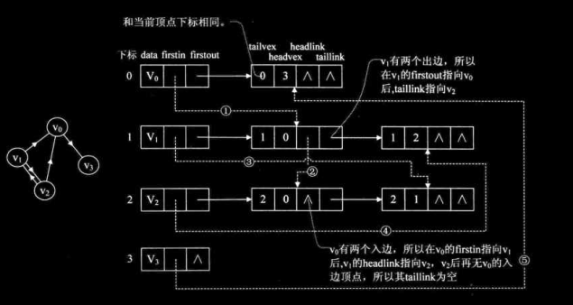
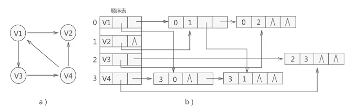

图
===

## 图的物理结构比较复杂

### 邻接矩阵
顶点使用线性序列存储，如Array，链表   
弧用二维数组【邻接矩阵】存储   

> 无向图
* 0 - 不相接  
* 1 - 表示相接  

> 有向图
y - x > 0 出， < 0 入

代码参考 [matrix_graph.h](./matrix_graph.h) 和 [matrix_graph.c](./matrix_graph.c).CreateMGraph   

邻接矩阵对空间浪费比较大，尤其是边很少的，但顶点很多的图

### 邻接表
使用数组与链表结合的图存储结构成为**邻接表**。   

图中的顶点使用数组（或链表）存储，每个数据元素存储指向第一个邻接点的指针，便于查找该顶点的边信息   

图中的每个顶点v的所有邻接点构成的一个线性表。
代码参考 [matrix_graph.h](./matrix_graph.h) 和 [matrix_graph.c](./matrix_graph.c).CreateALGraph   

### 十字链表
用邻接表存储有向图（网），可以快速计算出某个顶点的出度，但计算入度的效率不高。反之，用逆邻接表存储有向图（网），可以快速计算出某个顶点的入度，但计算出度的效率不高。    

那么有没有一种存储结构，可以快速计算出有向图（网）中某个顶点的入度和出度呢？答案是肯定的，十字链表就是这样的一种存储结构       

**核心思想**：将图中的所有顶点存储到顺序表（也可以是链表）中，同时为每个顶点配备两个链表，一个链表记录以当前顶点为弧头的弧，另一个链表记录以当前顶点为弧尾的弧    

代码参考 [matrix_graph.h](./matrix_graph.h) 和 [matrix_graph.c](./matrix_graph.c).CreateOLGraph   

在十字链表结构中，如果想计算某个顶点的出度，就统计 firstout 所指链表中的结点数量，每找到一个结点，再根据它的 tlink 指针域寻找下一个结点，直到最后一个结点。同样的道理，如果想计算某个顶点的入度，就统计 firstin 所指链表中的结点数量，每找到一个结点，再根据它的 hlink 指针域寻找下一个结点，直到最后一个结点。

以图 1b) 中的 V1 顶点为例，计算出度的过程是：  

根据 V1 顶点的 firstout 指针，找到存储 <V1, V2> 弧的结点；  
根据 <V1, V2> 弧结点中的 tlink 指针，找到存储 <V1, V3> 弧的结点；  
由于 <V1, V3> 弧结点的 tlink 指针为 NULL，因此只找到了 2 个弧，V1 顶点的出度就为 2。  

计算 V1 顶点入度的过程是：  
根据 V1 顶点的 firstin 指针，找到存储 <V4, V1> 弧的结点；  
由于 <V4, V1> 弧结点的 hlink 指针为 NULL，因此只找到了 1 个弧，V1 顶点的入度就为 1。  

## 图遍历

### 深度优先遍历

深度优先也称深度优先搜索，简称DFS，深度优先类似于树的先序遍历。
参考代码[search_graph.c](search_graph.c).DFSTraverse 方法

### 广度优先遍历

广度优先又称为广度优先搜索，简称BFS， 广度优先类似于树的层序遍历
参考代码[search_graph.c](search_graph.c).BFSTraverse 方法

## 最小生成树

使用最小的代价进行网络构建

### Prim 算法
参考代码[prim.c](prim.c).MiniSpanTree_Prim

## 图应用

- 最小生成树 【连接所有的节点最小成本】
- 最短路径 【指定节点到指定节点的最短路径】
- 拓扑排序 【AOV网流程合理编排, 解决一个工程能否顺序执行的问题】,对一个有向图构造拓扑序列的过程
- 关键路径 【AOE网流程找出工程的最大长度的路径叫关键路径】即 完成一系列活动最少需要多少天