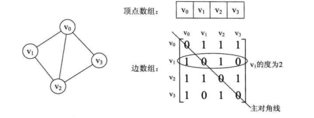
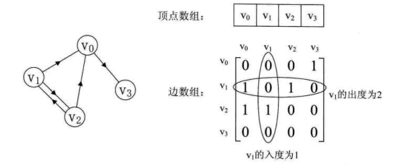

图
===

## 图的物理结构比较复杂

### 邻接矩阵
顶点使用线性序列存储，如Array，链表   
弧用二维数组【邻接矩阵】存储   

> 无向图
* 0 - 不相接  
* 1 - 表示相接  

> 有向图
y - x > 0 出， < 0 入

代码参考 [matrix_graph.h](./matrix_graph.h) 和 [matrix_graph.c](./matrix_graph.c).CreateMGraph   

邻接矩阵对空间浪费比较大，尤其是边很少的，但顶点很多的图

### 邻接表
使用数组与链表结合的图存储结构成为**邻接表**。   

图中的顶点使用数组（或链表）存储，每个数据元素存储指向第一个邻接点的指针，便于查找该顶点的边信息   

图中的每个顶点v的所有邻接点构成的一个线性表。
代码参考 [matrix_graph.h](./matrix_graph.h) 和 [matrix_graph.c](./matrix_graph.c).CreateALGraph   

### 十字链表