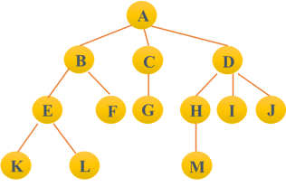
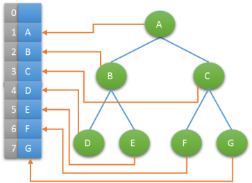
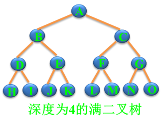
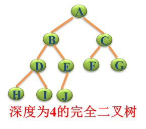

数据结构
===
## 理论
数据：是描述客观事物的符号，是计算机中可以操作的对象，是能被计算机识别，并输入给计算机处理的符号集合。数据不仅仅包括整型、实型等数值类型，还包括字符及声音、图像、视频等非数值类型   

数据结构是计算机存储、组织数据的方式  

算法是特定问题求解步骤的描述，在计算机中表现为指令的有限序列，算法是独立存在的一种解决问题的方法和思想  

### 逻辑结构
#### 集合结构
集合结构中的数据元素除了同属于一个集合外，他们之间没有其他关系，各个数据元素是平等的，他们共同属于同一个集合。

#### 线性结构
线性结构中的数据元素之间是一对一的关系，可以通过一个元素找到下一个元素。


#### 树形结构
树形结构中是数据元素之间存在一种一对多的层次关系
   

由一个或多个(n≥0)结点组成的有限集合T，有且仅有一个结点称为根（root），当n>1时，其余的结点分为m(m≥0)个互不相交的有限集合T1,T2，…，Tm。每个集合本身又是棵树，被称作这个根的子树  

#### 图结构
图形结构的数据元素是多对多的关系


### 物理结构
物理结构, 也书称存储结构，是指数据的逻辑结构在计算机中的存储形式，共分为两种：顺序存储和链式存储。

#### 顺序存储
是把数据元素存放在地址连续的存储单元里，其数据的逻辑关系和物理关系是一致的。如数组

#### 链式存储结构
是把数据元素存放在任意的存储单元里，这组存储单元可以是连续的，也可以是不连续的。数据元素的存储关系并不能反映其逻辑关系，因此需要用一个指针存放数据元素的地址，这样通过地址就可以找到相关数据的位置,如链表。


## 线性表
线性结构是一种最简单且常用的数据结构。线性结构的基本特点是节点之间满足线性关系,常见的线性结构有**动态数组**、**链表**、**栈**、**队列**。   

他们的共同之处，是节点中有且只有一个开始节点和终端节点，数据元素之间是有顺序的，数据元素个数是有限的，数据元素的类型必须相同。  

### 动态数组
采用顺序存储是表示线性表最简单的方法，具体做法是：将线性表中的元素一个接一个的存储在一块连续的存储区域中，这种顺序表示的线性表也成为顺序表，当长度不足时自动申请新的内存为其补充。


#### 特点
* 无需为线性表中的逻辑关系增加额外的空间。   
* 可以快速的获取表中合法位置的元素。  

> 缺点: 插入和删除操作需要移动大量元素.

#### 实现
线性表 - 动态数组采用List进行实现，其定义如下：
```c
```
可参考代码[case_1.c](dynamic-array/case_1.c)

### 链表
基于数组实现，静态数组`int arr[10]` 大小固定，数据过多时会空间益处，数据过小造成空间浪费    
动态数组使用 `malloc calloc realloc` 空间合理利用了，但不能快捷的插入或删除数据，因为涉及到大量的数据移动     


#### 特点
链表是一种 物理存储上非连续，数据元素是逻辑顺序通过链表中的指针链接次序实现的一种线性存储结构；   

运行时采用动态生成`malloc`，每个节点包含两个部分，一个是存储数据的`数据域`，另一个是存储下一个节点的`指针域`。    

#### 实现
链表的结构体 定义如下
```c
typedef struct stu {

    // 数据域
    char[32] name;
    int id;
    float score;

    // 指针域
    struct stu * next;
    struct stu * prev;
} STU;
```
> next 表示下一个数据的指针[必须]
> prev 表示上一个数据的指针[可选]

拥有指向前后的那种链表则为 双向链表，一般用的比较多的是单向即`next`表示。   

可参考代码[case_1.c](linear-list/case_1.c).staticLinkedArr()   
动态链表代码参考[case_2.c](linear-list/case_2.c), 演示动态链表的三种插入方式 头插入、尾插入及中间插入。

### 栈
栈(Stack), 栈元素具有线性关系，即前驱后继关系，即在线性表的表尾进行插入和删除操作。  

它的特殊之处在于限制了这个线性表的插入和删除的位置，它始终只在栈顶（表尾）进行。这也就使得：栈底是固定的，最先进栈的只能在栈底。

#### 特点
* 就近匹配

### 队列
队列（queue）是只允许在一端进行插入操作，而在另一端进行删除操作的线性表.   

队列是一种先进先出的t（First In First Out）的线性表，简称FIFO。允许插入的一端为队尾，允许删除的一端为队头。队列不允许在中间部位进行操作  

## 树

其特点如下：
* 非线性结构，有一个直接前驱，但可能有多个直接后继（1:n）
* 树的定义具有递归性，树中还有树。
* 树可以为空，即节点个数为0。

专业术语
| 名称 | 解释
| --- | ----
| 根 | 根结点(没有前驱)
| 叶子 | 即终端结点(没有后继)
| 森林 | 指m棵不相交的树的集合(例如删除A节点后的子树个数被成为森林)
| 有序树 | 结点各子树从左至右有序，不能互换（左为第一）
| 无序树 | 结点各子树可互换位置
| 双亲 | 即上层的那个结点(直接前驱) parent
| 孩子 | 即下层结点的子树 (直接后继) child
| 兄弟 | 同一双亲下的同层结点（孩子之间互称兄弟）sibling
| 堂兄弟 | 即双亲位于同一层的结点（但并非同一双亲）cousin
| 祖先 | 即从根到该结点所经分支的所有结点
| 子孙 | 即该结点下层子树中的任一结点
| 结点 | 即树的数据元素  
| 结点的度 | 结点挂接的子树数（有几个直接后继就是几度）
| 结点的层次 | 从根到该结点的层数（根结点算第一层）
| 终端结点 | 即度为0的结点，即叶子  
| 分支结点 | 除树根以外的结点（也称为内部结点）
| 树的度 | 所有结点度中的最大值（Max{各结点的度}） 
| 树的深度(或高度) | 指所有结点中最大的层数（Max{各结点的层次}）上图中的结点数＝ 13，树的度＝ 3，树的深度＝ 4


### 二叉树
n（n≥0）个结点的有限集合，由一个根结点以及两棵互不相交的、分别称为左子树和右子树的二叉树组成, 每个结点最多只有两棵子树（不存在度大于2的结点）, 左子树和右子树次序不能颠倒.

#### 特点
* 在二叉树的第i层上至多有2i-1个结点（i>0）
* 深度为k的二叉树至多有2k-1个结点（k>0）
* 对于任何一棵二叉树，若度为2的结点数有n2个，则叶子数（n0）必定为n2＋1 （即n0=n2+1）
* 对完全二叉树，若从上至下、从左至右编号，则编号为i 的结点，其左孩子编号必为2i，其右孩子编号必为2i＋1；其双亲的编号必为i/2（i＝1 时为根,除外）

> 使用此性质可以使用完全二叉树实现树的顺序存储

#### 概念解释

**满二叉树**

一棵深度为k 且有2k -1个结点的二叉树。每层都“充满”了结点,如下图


**完全二叉树**   

除最后一层外，每一层上的节点数均达到最大值；在最后一层上只缺少右边的若干结点。   



#### 实现
##### 二叉树的链表实现

* 二叉链表示法
```c
typedef struct BiTNode {
    int data;
    struct BiNode *lchild, *rchild;
} BiTnode, *BiTree;
```

* 三叉链表示法
```c
typedef struct TriNode {
    int data;
    struct TriNode *lchild, *rchild;
    struct TriNode *parent;
} TriNode, *TriTree;
```
代码参考[tree/case_1](tree/case_1.c)

##### 二叉树的遍历
遍历指的是按某条搜索路线遍访每个结点且不重复。

###### 遍历方法
牢记一种约定，**对每个结点的查看都是“先左后右” **。  
限定先左后右，树的遍历有三种实现方案。

* DLR - 先(根)序遍历, 即先根再左再右
* LDR - 中(根)序遍历，即先左再根再右
* LRD - 后(根)序遍历，即先左再右再根

> “先、中、后”的意思是指访问的结点D是先于子树出现还是后于子树出现。
从递归的角度看，这三种算法是完全相同的，或者说这三种遍历算法的访问路径是相同的，只是访问结点的时机不同