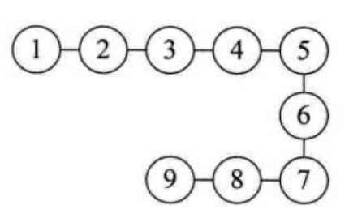
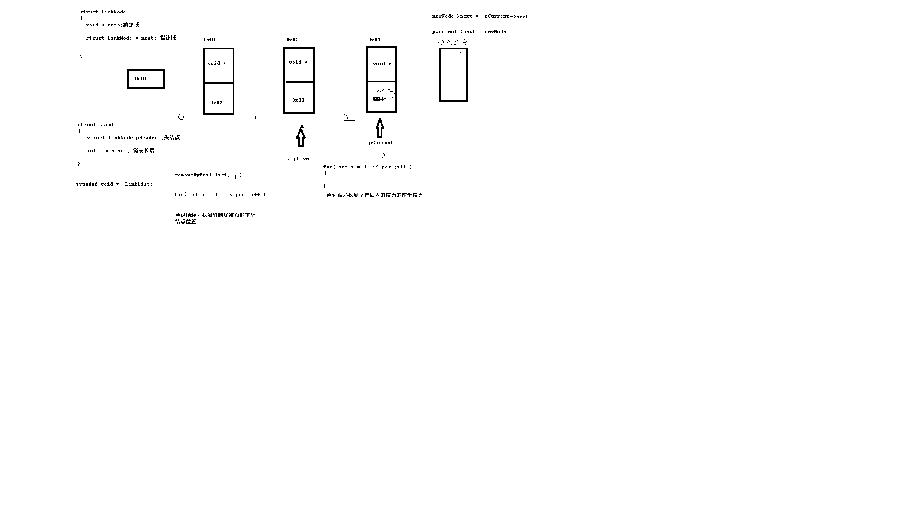

数据结构
===
## 理论
数据：是描述客观事物的符号，是计算机中可以操作的对象，是能被计算机识别，并输入给计算机处理的符号集合。数据不仅仅包括整型、实型等数值类型，还包括字符及声音、图像、视频等非数值类型   

数据结构是计算机存储、组织数据的方式  

算法是特定问题求解步骤的描述，在计算机中表现为指令的有限序列，算法是独立存在的一种解决问题的方法和思想  

### 逻辑结构
#### 集合结构
集合结构中的数据元素除了同属于一个集合外，他们之间没有其他关系，各个数据元素是平等的，他们共同属于同一个集合。

#### 线性结构
线性结构中的数据元素之间是一对一的关系，可以通过一个元素找到下一个元素。


#### 树形结构
树形结构中是数据元素之间存在一种一对多的层次关系


#### 图结构
图形结构的数据元素是多对多的关系


### 物理结构
物理结构, 也书称存储结构，是指数据的逻辑结构在计算机中的存储形式，共分为两种：顺序存储和链式存储。

#### 顺序存储
是把数据元素存放在地址连续的存储单元里，其数据的逻辑关系和物理关系是一致的。如数组

#### 链式存储结构
是把数据元素存放在任意的存储单元里，这组存储单元可以是连续的，也可以是不连续的。数据元素的存储关系并不能反映其逻辑关系，因此需要用一个指针存放数据元素的地址，这样通过地址就可以找到相关数据的位置,如链表。


## 线性表
线性结构是一种最简单且常用的数据结构。线性结构的基本特点是节点之间满足线性关系,常见的线性结构有**动态数组**、**链表**、**栈**、**队列**。   

他们的共同之处，是节点中有且只有一个开始节点和终端节点，数据元素之间是有顺序的，数据元素个数是有限的，数据元素的类型必须相同。  


## 链表

基于数组实现，静态数组`int arr[10]` 大小固定，数据过多时会空间益处，数据过小造成空间浪费    
动态数组使用 `malloc calloc realloc` 空间合理利用了，但不能快捷的插入或删除数据，因为涉及到大量的数据移动     


### 特点
链表是一种 物理存储上非连续，数据元素是逻辑顺序通过链表中的指针链接次序实现的一种线性存储结构；   
运行时采用动态生成`malloc`，每个节点包含两个部分，一个是存储数据的`数据域`，另一个是存储下一个节点的`指针域`。    

链表的结构体 定义如下
```c
typedef struct stu {

    // 数据域
    char[32] name;
    int id;
    float score;

    // 指针域
    struct stu * next;
    struct stu * prev;
} STU;
```
> next 表示下一个数据的指针[必须]
> prev 表示上一个数据的指针[可选]

拥有指向前后的那种链表则为 双向链表，一般用的比较多的是单向即`next`表示。   

可参考代码[case_1.c](case_1.c).staticLinkedArr()   
动态链表代码参考[case_2.c](case_2.c), 演示动态链表的三种插入方式 头插入、尾插入及中间插入。