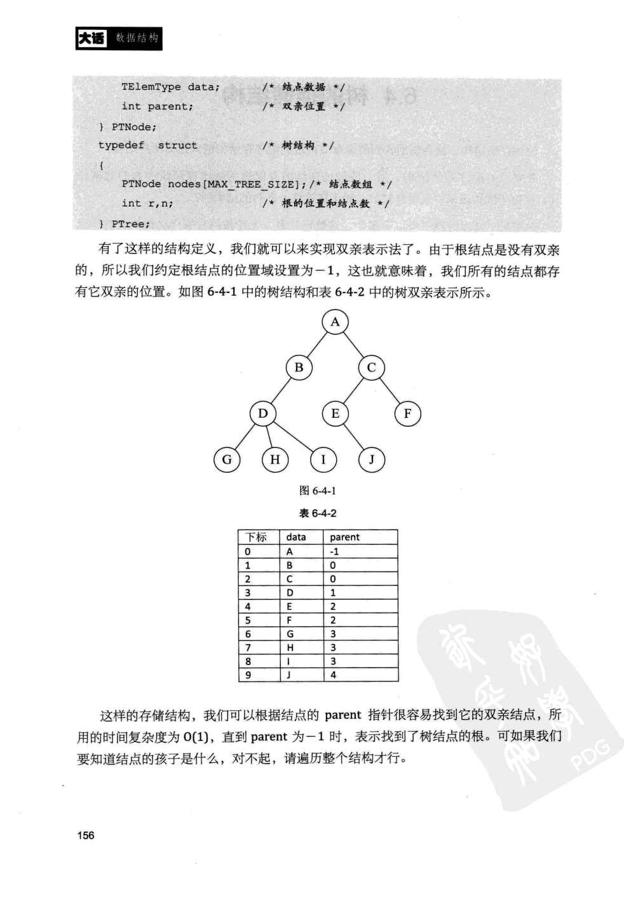
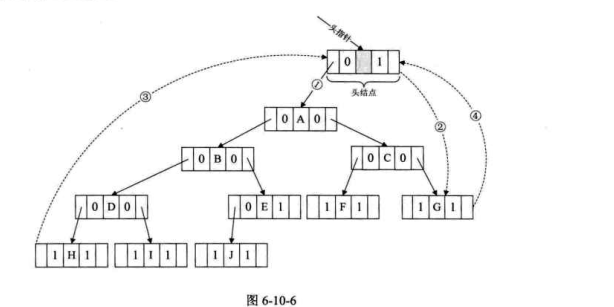

树
===

基于数组实现的 双亲表示 法 示意

## 二叉树
### 特性 

* 在二叉树的第i层上至多有2（i-1）次方个结点，i大于等于1；
* 深度为k的二叉树最多又2k次方-1个结点。
* 对于任何一颗二叉树T，如果其终端结点数为n，度为2的结点为m，则终端结点数n=m+1

### 二叉树的遍历
从根节点出发，按照某种次序依次访问树中所有的结点，每个结点仅被访问一次。   

中序遍历 二叉线索链  示意图

> 代码参考[bi_tree.c](./bi_tree.c).InOrderTraverse_Thr