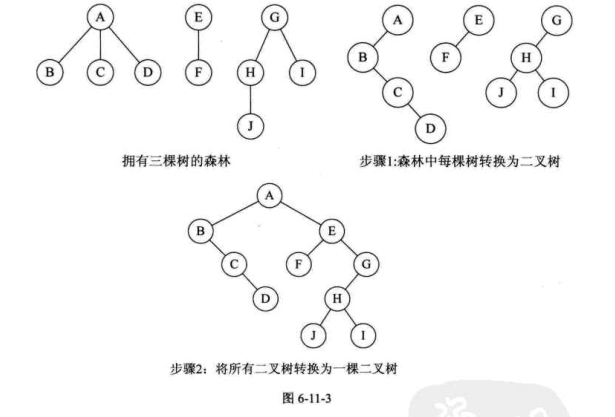
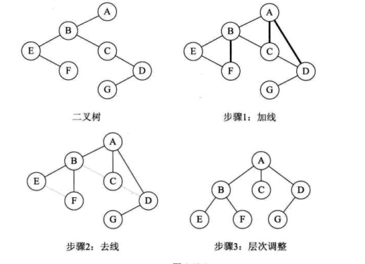
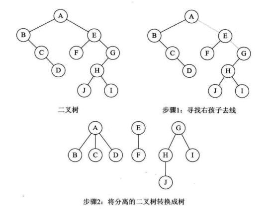

树
===

基于数组实现的 双亲表示 法 示意

## 二叉树
### 特性 

* 在二叉树的第i层上至多有2（i-1）次方个结点，i大于等于1；
* 深度为k的二叉树最多又2k次方-1个结点。
* 对于任何一颗二叉树T，如果其终端结点数为n，度为2的结点为m，则终端结点数n=m+1

### 二叉树的遍历
从根节点出发，按照某种次序依次访问树中所有的结点，每个结点仅被访问一次。   

中序遍历 二叉线索链  示意图

> 代码参考[bi_tree.c](./bi_tree.c).InOrderTraverse_Thr

## 树转二叉树
### 步骤
* 加线， 给树中所有的兄弟结点之间加一条线；
* 去线， 对树中的每个结点，只保留与第一个孩子的结点的连接线，删除与其他孩子结点之间的连线；
* 层次调整

## 森林转二叉树
### 步骤
* 将每个树转换为二叉树
* 以此将转换的后的二叉树连接, 从后开始，每一棵树的根结点是前一颗树根结点的右孩子，并连接起来。

> 第一棵树不动，第二棵的根节点作为第一个棵树的根节点的右孩子，并用线连起来。以此类推

## 二叉树转树
与树转二叉树的步骤类似
### 步骤
* 加线，若某节点的左孩子节点存在，则将这个左孩子的右孩子节点（右孩子的右孩子，所有右孩子节点）与节点连接，视为该节点的子结点；
* 去线，删除二叉树中所有节点与其右孩子节点的连线；
* 层次调整

## 二叉树转森林
### 步骤
* 从根节点开始，若右孩子存在，则把与右孩子节点的连线删除，从最右侧（最右的右孩子）开始，依次拆出二叉树。
* 再将二叉树转换为树
