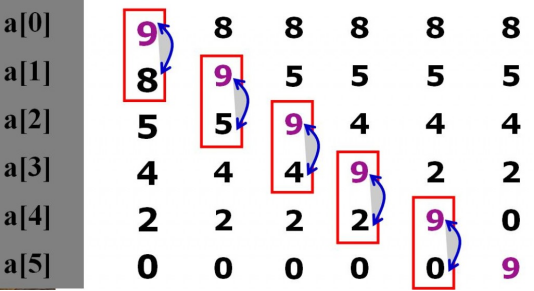
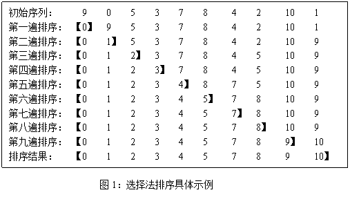
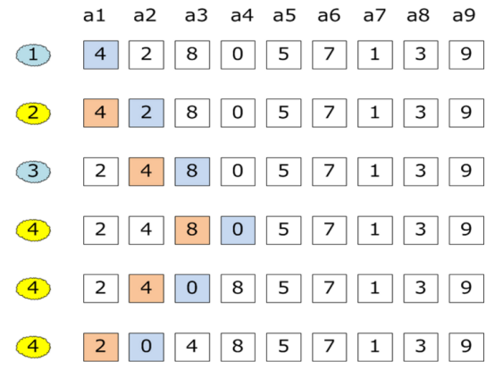

搜索与排序
===

## 搜索
### 顺序表查找
数组的循环，优化就是从数组的最后一个元素的下标往前找，若为0没有目标表示失败。

### 有序表查找
#### 折半查找
折半查找又称为二分查找，要求线性表中数据是有序的。
代码参考[case_1.c](case_1.c)

#### 插值查找
根据要查找的关键字kye与查找表值中最大 最小记录的关键字比较后的查找方法。  
`mid = low + (high -low) * (key - a[low]) / (a[heigh] - a[low]);`
适用于树值分布均匀的数据。

#### 斐波纳切查找
利用了黄金分割原理实现，是一种改良版本的折半查找   
参考代码[case_2.c](case_2.c)

### 二叉树查找
对需要查询的数据生成一颗二叉树，然后根据二叉树的特性进行查找，而且二叉树这种非线性结构也有利于插入和删除。
参考代码[case_3.c](case_3.c)

### 平衡二叉树(AVL树)
TODO

### 多路查找树(B树)
TODO

### 散列表查找(Hash表)
TODO

## 排序
排序是计算机内经常进行的一种操作，其目的是将一组“无序”的数据元素调整为“有序”的数据元素

### 排序的好坏
* 时间性能：关键性能差异体现在比较和交换的数量
* 辅助存储空间：为完成排序操作需要的额外的存储空间，必要时可以“空间换时间”
* 算法的实现复杂性：过于复杂的排序法会影响代码的可读性和可维护性，也可能影响排序的性能

### 常用的排序算法

#### 冒泡排序

* 冒泡排序是一种效率低下的排序方法，在数据规模很小时，可以采用。数据规模比较大时，最好用其它排序方法。
* 上述例子总对冒泡做了优化，添加了flag作为标记，记录序列是否已经有序，减少循环次数。
> 代码参考[../section-05/case_2.c](../section-05/case_2.c)

#### 选择排序
每一趟从待排序的数据元素中选出最小（或最大）的一个元素，顺序放在已排好序的数列的最后，直到全部待排序的数据元素排完。

选择排序算法通过选择和交换来实现排序，其排序流程如下：
（1）首先从原始数组中选择最小的1个数据，将其和位于第1个位置的数据交换。
（2）接着从剩下的n-1个数据中选择次小的1个元素，将其和第2个位置的数据交换
（3）然后，这样不断重复，直到最后两个数据完成交换。最后，便完成了对原始数组的从小到大的排序。

> 代码参考[../section-07/linear-list/case_3.c](../section-07/linear-list/case_3.c)

#### 插入排序
插入排序算法是一种简单的排序算法，也成为直接插入排序算法。它是一种稳定的排序算法，对局部有序的数据具有较高的效率

插入排序算法是一个队少量元素进行排序的有效算法。比如，打牌是我们使用插入排序方法最多的日常生活例子。我们在摸牌时，一般会重复一下步骤。期初，我们手里没有牌，摸出第一张，随意放在左手上，以后每一次摸排，都会按照花色从小到大排列，直到所有的牌摸完。插入排序算法采用的类似思路，每一次从无序序列中拿出一个数据，将它放到已排序的序序列的正确位置，如此重复，直到所有的无序序列中的数据都找到了正确位置   