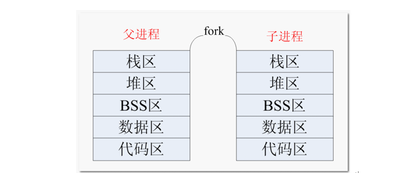

Linux C
===

## 系统调用含义
系统调用是属于操作系统内核的一部分的，必须以某种方式提供给进程让它们去调用。   

系统调用是需要时间的，程序中频繁的使用系统调用会降低程序的运行效率。    

当运行内核代码时，CPU工作在内核态，在系统调用发生前需要保存用户态的栈和内存环境，然后转入内核态工作。系统调用结束后，又要切换回用户态。这种环境的切换会消耗掉许多时间。  


## 错误处理函数
```c
#include <errno.h>
#include <string.h>
```
`errno` 是记录系统的最后一次错误代码。代码是一个int型的值，在errno.h中定义。
> 查看错误代码errno是调试程序的一个重要方法。

当Linux C api函数发生异常时，一般会将errno全局变量赋一个整数值，不同的值表示不同的含义，可以通过查看该值推测出错的原因。使用string.h中的strerror(errno)可以打印错误原因     

或者 `cat /usr/include/asm-generic/errno-base.h`和`cat /usr/include/asm-generic/errno.h` 能看到所有定义的错误。    

参考代码[case_1.c](case_1.c)    

## 系统调用相关API
```c
// 文件所有者 #include <pwd.h>
char* fileUser = getpwuid(st.st_uid)->pw_name;

// 文件所属组 #include <grp.h>
char* fileGrp = getgrgid(st.st_gid)->gr_name;

// 修改时间 #include <time.h>
char* time = ctime(&st.st_mtime);
char mtime[512] = { 0 };
strncpy(mtime, time, strlen(time) - 1);
```
参考 [系统调用相关API](system_invoke_api.md)

## 时间相关函数

引入头文件`utime.h` 和 `time.h`;

```c
   char *asctime(const struct tm *tm);
   char *asctime_r(const struct tm *tm, char *buf);
​
   char *ctime(const time_t *timep);
   char *ctime_r(const time_t *timep, char *buf);
​
   struct tm *gmtime(const time_t *timep);
   struct tm *gmtime_r(const time_t *timep, struct tm *result);
​
   struct tm *localtime(const time_t *timep);
   struct tm *localtime_r(const time_t *timep, struct tm *result);
​
   time_t mktime(struct tm *tm);
```


## 进程
内核为进程每个进程分配一个PCB（进程控制块），维护进程相关的信息，Linux内核的进程控制块是task_struct结构体。在 /usr/src/linux-headers-xxx/include/linux/sched.h 文件中可以查看struct task_struct 结构体定义    

掌握内容如下：
* 进程id。系统中每个进程有唯一的id，在C语言中用pid_t类型表示，其实就是一个非负整数。
* 进程的状态，有就绪、运行、挂起、停止等状态。
* 进程切换时需要保存和恢复的一些CPU寄存器。
* 描述虚拟地址空间的信息。
* 描述控制终端的信息。
* 当前工作目录（Current Working Directory）。
* umask掩码。
* 文件描述符表，包含很多指向file结构体的指针。
* 和信号相关的信息。
* 用户id和组id。
* 会话（Session）和进程组。
* 进程可以使用的资源上限（Resource Limit）

相关api参考[进程相关API](./thread_api.md)

### 子进程

使用 fork() 函数得到的子进程是父进程的一个复制品，它从父进程处继承了整个进程的地址空间：包括进程上下文（进程执行活动全 过程的静态描述）、进程堆栈、打开的文件描述符、信号控制设定、进程优先级、进程组号等。    


子进程所**独有**的只有它的**进程号，计时器等（只有小量信息）**。    
> 子进程修改变量 a，b 的值，并不影响到父进程 a，b 的值。栈独立

因此，使用 fork() 函数的代价是很大的。    

