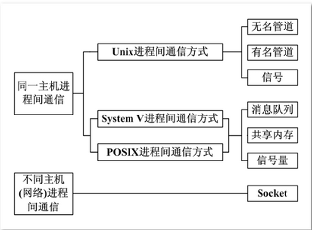
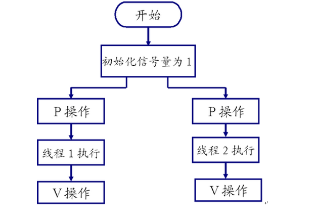

Linux C
===

## 系统调用含义
系统调用是属于操作系统内核的一部分的，必须以某种方式提供给进程让它们去调用。   

系统调用是需要时间的，程序中频繁的使用系统调用会降低程序的运行效率。    

当运行内核代码时，CPU工作在内核态，在系统调用发生前需要保存用户态的栈和内存环境，然后转入内核态工作。系统调用结束后，又要切换回用户态。这种环境的切换会消耗掉许多时间。  


## 错误处理函数
```c
#include <errno.h>
#include <string.h>
```
`errno` 是记录系统的最后一次错误代码。代码是一个int型的值，在errno.h中定义。
> 查看错误代码errno是调试程序的一个重要方法。

当Linux C api函数发生异常时，一般会将errno全局变量赋一个整数值，不同的值表示不同的含义，可以通过查看该值推测出错的原因。使用string.h中的strerror(errno)可以打印错误原因     

或者 `cat /usr/include/asm-generic/errno-base.h`和`cat /usr/include/asm-generic/errno.h` 能看到所有定义的错误。    

参考代码[case_1.c](case_1.c)    

## 系统调用相关API
```c
// 文件所有者 #include <pwd.h>
char* fileUser = getpwuid(st.st_uid)->pw_name;

// 文件所属组 #include <grp.h>
char* fileGrp = getgrgid(st.st_gid)->gr_name;

// 修改时间 #include <time.h>
char* time = ctime(&st.st_mtime);
char mtime[512] = { 0 };
strncpy(mtime, time, strlen(time) - 1);
```
参考 [系统调用相关API](system_invoke_api.md)

## 时间相关函数

引入头文件`utime.h` 和 `time.h`;

```c
   char *asctime(const struct tm *tm);
   char *asctime_r(const struct tm *tm, char *buf);
​
   char *ctime(const time_t *timep);
   char *ctime_r(const time_t *timep, char *buf);
​
   struct tm *gmtime(const time_t *timep);
   struct tm *gmtime_r(const time_t *timep, struct tm *result);
​
   struct tm *localtime(const time_t *timep);
   struct tm *localtime_r(const time_t *timep, struct tm *result);
​
   time_t mktime(struct tm *tm);
```


## 进程
内核为进程每个进程分配一个PCB（进程控制块），维护进程相关的信息，Linux内核的进程控制块是task_struct结构体。在 /usr/src/linux-headers-xxx/include/linux/sched.h 文件中可以查看struct task_struct 结构体定义    

掌握内容如下：
* 进程id。系统中每个进程有唯一的id，在C语言中用pid_t类型表示，其实就是一个非负整数。
* 进程的状态，有就绪、运行、挂起、停止等状态。
* 进程切换时需要保存和恢复的一些CPU寄存器。
* 描述虚拟地址空间的信息。
* 描述控制终端的信息。
* 当前工作目录（Current Working Directory）。
* umask掩码。
* 文件描述符表，包含很多指向file结构体的指针。
* 和信号相关的信息。
* 用户id和组id。
* 会话（Session）和进程组。
* 进程可以使用的资源上限（Resource Limit）

相关api参考[进程相关API](./thread_api.md)

### 子进程

使用 fork() 函数得到的子进程是父进程的一个复制品，它从父进程处继承了整个进程的地址空间：包括进程上下文（进程执行活动全 过程的静态描述）、进程堆栈、打开的文件描述符、信号控制设定、进程优先级、进程组号等。    


子进程所**独有**的只有它的**进程号，计时器等（只有小量信息）**。    
> 子进程修改变量 a，b 的值，并不影响到父进程 a，b 的值。栈独立

因此，使用 fork() 函数的代价是很大的。    

### 僵尸进程
僵尸进程（Zombie Process）是一种特殊的进程状态，它指的是一个已经完成执行的进程，其父进程尚未通过 wait() 或 waitpid() 系统调用来回收其资源和状态信息。 僵尸进程本身并不占用CPU和其他资源，但它的进程描述符（PCB）仍然保留在系统中，这会占用系统资源并可能导致系统性能问题，尤其是在系统资源有限的情况下

## 进程间通讯
进程是一个独立的资源分配单元，不同进程（这里所说的进程通常指的是用户进程）之间的资源是独立的，没有关联，不能在一个进程中直接访问另一个进程的资源。   



但是，进程不是孤立的，不同的进程需要进行信息的交互和状态的传递等，因此需要进程间通信( IPC：Inter Processes Communication )。   

进程间通信的目的：   

* 数据传输：一个进程需要将它的数据发送给另一个进程。
* 通知事件：一个进程需要向另一个或一组进程发送消息，通知它（它们）发生了某种事件（如进程终止时要通知父进程）。
* 资源共享：多个进程之间共享同样的资源。为了做到这一点，需要内核提供互斥和同步机制。
* 进程控制：有些进程希望完全控制另一个进程的执行（如 Debug 进程），此时控制进程希望能够拦截另一个进程的所有陷入和异常，并能够及时知道它的状态改变。

### 管道
管道也叫无名管道，它是是 UNIX 系统 IPC（进程间通信） 的最古老形式，所有的 UNIX 系统都支持这种通信机制。   

无名管道只能用于亲缘关系的进程间通信。为了克服这个缺点，提出了命名管道（FIFO），也叫有名管道、FIFO文件。  

管道可以使用open打开它，常见的文件I/O函数都可用于fifo。如：close、read、write、unlink等。  

FIFO严格遵循先进先出（first in first out），对管道及FIFO的读总是从开始处返回数据，对它们的写则把数据添加到末尾。但是， 它们不支持诸如lseek()等文件定位操作  

> 一个为只读而打开一个管道的进程会阻塞直到另外一个进程为只写打开该管道     
> 一个为只写而打开一个管道的进程会阻塞直到另外一个进程为只读打开该管道     


## 共享存储映射
存储映射I/O (Memory-mapped I/O) 使一个磁盘文件与存储空间中的一个缓冲区相映射。于是当从缓冲区中取数据，就相当于读文件中的相应字节。于此类似，将数据存入缓冲区，则相应的字节就自动写入文件。这样，就可在不适用read和write函数的情况下，使用地址（指针）完成I/O操作。  

共享内存可以说是最有用的进程间通信方式，也是最快的IPC形式, 因为进程可以直接读写内存，而不需要任何数据的拷贝。   

## 如何避免僵尸进程
1) 最简单的方法，父进程通过 wait() 和 waitpid() 等函数等待子进程结束，但是，这会导致父进程挂起。

2) 如果父进程要处理的事情很多，不能够挂起，通过 signal() 函数人为处理信号 SIGCHLD ， 只要有子进程退出自动调用指定好的回调函数，因为子进程结束后， 父进程会收到该信号 SIGCHLD ，可以在其回调函数里调用 wait() 或 waitpid() 回收。

## 守护进程
守护进程（Daemon Process），也就是通常说的 Daemon 进程（精灵进程），是 Linux 中的后台服务进程。它是一个生存期较长的进程，通常独立于控制终端并且周期性地执行某种任务或等待处理某些发生的事件。一般采用以d结尾的名字。   

### 守护进程模型
#### 创建子进程，父进程退出(必须)  
所有工作在子进程中进行形式上脱离了控制终端

#### 在子进程中创建新会话(必须)
setsid()函数，使子进程完全独立出来，脱离控制。

#### 改变当前目录为根目录(不是必须)
chdir()函数，防止占用可卸载的文件系统，也可以换成其它路径。

#### 重设文件权限掩码(不是必须)
umask()函数， 防止继承的文件创建屏蔽字拒绝某些权限，增加守护进程灵活性。

#### 关闭文件描述符(不是必须)
继承的打开文件不会用到，浪费系统资源，无法卸载

#### 开始执行守护进程核心工作(必须)
> 参考代码[每隔2s获取一次系统时间并写入文件](case_8.c)


## 线程
线程是轻量级的进程（LWP：light weight process），在Linux环境下线程的本质仍是进程

### 线程函数列表安装
```shell
sudo apt-get install manpages-posix-dev

man -k pthread
```
manpages-posix-dev 包含 POSIX 的 header files 和 library calls 的用法.

### NPTL
当 Linux 最初开发时，在内核中并不能真正支持线程。但是它的确可以通过 clone() 系统调用将进程作为可调度的实体. NPTL，或称为 Native POSIX Thread Library，是 Linux 线程的一个新实现克服了在信号处理、调度和进程间同步原语方面都存在问题，同时也符合 POSIX 的需求.

查看当前pthread库版本：
```shell
getconf GNU_LIBPTHREAD_VERSION
```

相关线程API参考[线程API](thread_pool_api.md)

### 僵尸线程
僵尸线程（Zombie Thread）是指在Linux系统中，一个已经完成执行但其进程描述信息仍然保存在进程表中的线程。这种线程实际上已经停止运行，但它的进程ID和部分资源没有被操作系统立即回收，因此它们会占用系统资源，尤其是进程号，这在进程号有限的系统中可能会导致无法创建新的进程。

### 线程使用注意事项
* 主线程退出其他线程不退出，主线程应调用pthread_exit
* 避免僵尸线程，使用API如 `pthread_join pthread_detach pthread_create指定分离属性`  
* 被join线程可能在join函数返回前就释放完自己的所有内存资源，所以不应当返回被回收线程栈中的值;

1) malloc和mmap申请的内存可以被其他线程释放  
2) 应避免在多线程模型中调用fork，除非马上exec，子进程中只有调用fork的线程存在，其他线程t在子进程中均pthread_exit  
3) 信号的复杂语义很难和多线程共存，应避免在多线程引入信号机制   


## 锁
锁的核心功能是 同步和互斥， 用于解决都需要访问/使用同一种资源或多个任务之间有依赖关系，某个任务的运行依赖于另一个任务。

所谓 互斥 和 同步的定义如下：   
**互斥**：是指散步在不同任务之间的若干程序片断，当某个任务运行其中一个程序片段时，其它任务就不能运行它们之中的任一程序片段，只能等到该任务运行完这个程序片段后才可以运行。最基本的场景就是：一个公共资源同一时刻只能被一个进程或线程使用，多个进程或线程不能同时使用公共资源。


**同步**：是指散步在不同任务之间的若干程序片断，它们的运行必须严格按照规定的某种先后次序来运行，这种先后次序依赖于要完成的特定的任务。最基本的场景就是：两个或两个以上的进程或线程在运行过程中协同步调，按预定的先后次序运行。比如 A 任务的运行依赖于 B 任务产生的数据。

### 互斥锁 Mutex

#### 安装
```shell
sudo apt-get install manpages-posix-dev

man -k manpages-posix-dev
```

相关API参考 [Mutex_api](mutex_api.md)  
> 示例代码[case_13.c](case_13.c)

#### 读写锁 
> 示例代码[case_14.c](case_14.c)

读写锁的特点如下：

1）如果有其它线程读数据，则允许其它线程执行读操作，但不允许写操作。  
2）如果有其它线程写数据，则其它线程都不允许读、写操作。  


读写锁分为读锁和写锁，规则如下：

1）如果某线程申请了读锁，其它线程可以再申请读锁，但不能申请写锁。  
2）如果某线程申请了写锁，其它线程不能申请读锁，也不能申请写锁。  

#### 条件变量
与互斥锁不同，条件变量是用来等待而不是用来上锁的，条件变量本身不是锁！

条件变量用来自动阻塞一个线程，直到某特殊情况发生为止。通常条件变量和互斥锁同时使用。

条件变量的两个动作：
* 条件不满, 阻塞线程
* 当条件满足, 通知阻塞的线程开始工作

> 示例代码[生产者消费者条件变量模型](case_15.c)

相较于mutex而言，条件变量可以减少竞争。

如直接使用mutex，除了生产者、消费者之间要竞争互斥量以外，消费者之间也需要竞争互斥量，但如果汇聚（链表）中没有数据，消费者之间竞争互斥锁是无意义的。   

有了条件变量机制以后，只有生产者完成生产，才会引起消费者之间的竞争。提高了程序效率   


## 信号量与PV操作
信号量广泛用于进程或线程间的同步和互斥，信号量本质上是一个非负的整数计数器，它被用来控制对公共资源的访问。  

编程时可根据操作信号量值的结果判断是否对公共资源具有访问的权限，当信号量值大于 0 时，则可以访问，否则将阻塞。  

### PV 
原语是对信号量的操作，一次 P 操作使信号量减１，一次 V 操作使信号量加１。


相关API参考[pv_option_api.md](pv_option_api.md)  
示例代码[case_16.c](case_16.c)

### 扩展内容
自旋锁
```c
int pthread_spin_destroy(pthread_spinlock_t *lock);
int pthread_spin_init(pthread_spinlock_t *lock, int pshared);
```
屏障   
信号量：
```c
int semget(key_t key, int nsems, int semflg);
```