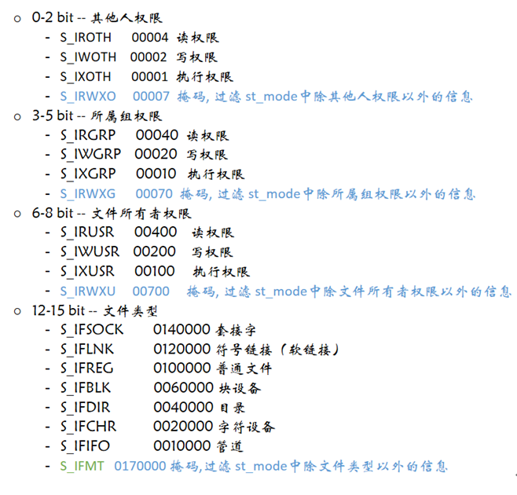
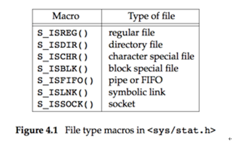

系统调用相关API
===

## 文件系统
### int open(const char*, int flags, mode_t mode)
头文件       
    #include <unistd.h>   
功能：   
    打开文件，如果文件不存在则可以选择创建。  
参数：  
    pathname：文件的路径及文件名  
    flags：打开文件的行为标志，必选项 O_RDONLY, O_WRONLY, O_RDWR  
    mode：这个参数，只有在文件不存在时有效，指新建文件时指定文件的权限  
返回值：
    成功：成功返回打开的文件描述符  
    失败：-1  

flags 列表
| 区值 | 含义 | 选项
| --- | ---- | --- 
| O_RDONLY |	以只读的方式打开 | 必填
| O_WRONLY |	以只写的方式打开 | 
| O_RDWR |	以可读、可写的方式打开 | 
| O_CREAT |	文件不存在则创建文件，使用此选项时需使用mode说明文件的权限 | 可选项，和必选项按`位或 | `起来
| O_EXCL |	如果同时指定了O_CREAT，且文件已经存在，则出错
| O_TRUNC |	如果文件存在，则清空文件内容
| O_APPEND |	写文件时，数据添加到文件末尾
| O_NONBLOCK |	对于设备文件, 以O_NONBLOCK方式打开可以做非阻塞I/O

mode 说明
| 取值 | 掩码 | 含义
| --- | ---- | ---
| S_IRWXU | 	00700 | 	文件所有者的读、写、可执行权限
| S_IRUSR | 	00400 | 	文件所有者的读权限
| S_IWUSR | 	00200 | 	文件所有者的写权限
| S_IXUSR | 	00100 | 	文件所有者的可执行权限
| S_IRWXG | 	00070 | 	文件所有者同组用户的读、写、可执行权限
| S_IRGRP | 	00040 | 	文件所有者同组用户的读权限
| S_IWGRP | 	00020 | 	文件所有者同组用户的写权限
| S_IXGRP | 	00010 | 	文件所有者同组用户的可执行权限
| S_IRWXO | 	00007 | 	其他组用户的读、写、可执行权限
| S_IROTH | 	00004 | 	其他组用户的读权限
| S_IWOTH | 	00002 | 	其他组用户的写权限
| S_IXOTH | 	00001 | 	其他组用户的可执行权限

> 从终端设备或网络读则不一定，如果从终端输入的数据没有换行符，调用read读终端设备就会阻塞，如果网络上没有接收到数据包，调用read从网络读就会阻塞，至于会阻塞多长时间也是不确定的，如果一直没有数据到达就一直阻塞在那里。

### int close(int fd)
头文件       
    #include <unistd.h>   
功能：   
    关闭已打开的文件   
参数：   
    fd : 文件描述符，open()的返回值   
返回值：   
    成功：0   
    失败： -1, 并设置errno   

当一个进程终止时，内核对该进程所有尚未关闭的文件描述符调用close关闭，所以即使用户程序不调用close，在终止时内核也会自动关闭它打开的所有文件。   

但是对于一个长年累月运行的程序(比如网络服务器)，打开的文件描述符一定要记得关闭,否则随着打开的文件越来越多，会占用大量文件描述符和系统资源。   


### ssize_t write(int fd, const void *buf, size_t count)
头文件       
    #include <unistd.h>   
功能：   
    把指定数目的数据写到文件（fd）   
参数：   
    fd :  文件描述符  
    buf : 数据首地址   
    count : 写入数据的长度（字节）  
返回值：  
    成功：实际写入数据的字节个数   
    失败： - 1  


### ssize_t read(int fd, void *buf, size_t count)
头文件       
    #include <unistd.h>   
功能：   
    把指定数目的数据读到内存（缓冲区）   
参数：  
    fd : 文件描述符  
    buf : 内存首地址  
    count : 读取的字节个数  
返回值：  
    成功：实际读取到的字节个数  
    失败： - 1  


### off_t lseek(int fd, off_t offset, int whence)
头文件       
    #include <unistd.h>   
功能：  
    改变文件的偏移量  
参数：  
    fd：文件描述符    
    offset：根据whence来移动的位移数（偏移量），可以是正数，也可以负数，如果正数，则相对于whence往右移动，如果是负数，则相对于whence往左移动。如果向前移动的字节数超过了文件开头则出错返回，如果向后移动的字节数超过了文件末尾，再次写入时将增大文件尺寸。    
​
    whence：其取值如下：   
        SEEK_SET：从文件开头移动offset个字节   
        SEEK_CUR：从当前位置移动offset个字节   
        SEEK_END：从文件末尾移动offset个字节   
返回值：   
    若lseek成功执行, 则返回新的偏移量   
    如果失败， 返回-1   

```c
int size = lseek(fp, 0, SEEK_END);
```
上面这个代码会返回该文件的字节大小


### int stat(const char *path, struct stat *buf)
头文件：   
    #include <sys/types.h>  
    #include <sys/stat.h>  
    #include <unistd.h>  
功能：  
    获取文件状态信息  
参数：  
    path：文件名  
    buf：保存文件信息的结构体  
返回值：  
    成功： 0  
    失败: -1  

```c

struct stat {
    dev_t           st_dev;     //文件的设备编号
    ino_t           st_ino;     //节点
    mode_t          st_mode;            //文件的类型和存取的权限
    nlink_t         st_nlink;       //连到该文件的硬连接数目，刚建立的文件值为1
    uid_t           st_uid;     //用户ID
    gid_t           st_gid;     //组ID
    dev_t           st_rdev;        //(设备类型)若此文件为设备文件，则为其设备编号
    off_t           st_size;        //文件字节数(文件大小)
    blksize_t       st_blksize;     //块大小(文件系统的I/O 缓冲区大小)
    blkcnt_t        st_blocks;      //块数
    time_t          st_atime;       //最后一次访问时间
    time_t          st_mtime;       //最后一次修改时间
    time_t          st_ctime;       //最后一次改变时间(指属性)
};
```
> `int lstat(const char *pathname, struct stat *buf);` stat和lstat的区别：当文件是一个符号链接时，lstat返回的是该符号链接本身的信息；  

st_mode 参数说明


文件类型判断应使用宏函数

> `#include <sys/stat.h>` 记得引包

### int access(const char *pathname, int mode)
头文件       
    #include <unistd.h>   
功能：测试指定文件是否具有某种属性  
参数：  
    pathname：文件名  
    mode：文件权限，4种权限   
        R_OK：   是否有读权限   
        W_OK：   是否有写权限   
        X_OK：   是否有执行权限   
        F_OK：   测试文件是否存在   
返回值：   
    0：  有某种权限，或者文件存在   
    -1： 没有，或文件不存在   

eg: `access("txt", F_OK)`

### int chmod(const char *pathname, mode_t mode)
头文件       
    #include <sys/stat.h>   
功能：修改文件权限  
参数：  
    filename：文件名  
    mode：权限(8进制数)  
返回值：  
    成功：0   
    失败：-1   

### int chown(const char *pathname, uid_t owner, gid_t group)
头文件       
    #include <unistd.h>   
功能：修改文件所有者和所属组   
参数：  
    pathname：文件或目录名  
    owner：文件所有者id，通过查看 /etc/passwd 得到所有者id  
    group：文件所属组id，通过查看 /etc/group 得到用户组id   
返回值：   
    成功：0   
    失败：-1   

### int truncate(const char *path, off_t length)
头文件       
    #include <unistd.h>     
    #include <sys/types.h>   
功能：修改文件大小   
参数：   
    path：文件文件名字   
    length：指定的文件大小   
        a)比原来小, 删掉后边的部分   
        b)比原来大, 向后拓展   
返回值：   
    成功：0   
    失败：-1   


### int link(const char *oldpath, const char *newpath)
头文件       
    #include <unistd.h>   
功能：创建一个硬链接
参数：
    oldpath：源文件名字
    newpath：硬链接名字
返回值：
    成功：0
    失败：-1

硬连接无法跨盘跨区创建，本质上是文件的指针，删除会对原有的文件有影响


### int symlink(const char *target, const char *linkpath)
头文件       
    #include <unistd.h>   
功能：创建一个软链接
参数：
    target：源文件名字
    linkpath：软链接名字
返回值：
    成功：0
    失败：-1


### ssize_t readlink(const char *pathname, char *buf, size_t bufsiz)
头文件       
    #include <unistd.h>   
功能：读软连接对应的文件名，不是读内容(该函数只能读软链接文件)
参数：
    pathname：软连接名
    buf：存放软件对应的文件名
    bufsiz ：缓冲区大小(第二个参数存放的最大字节数)
返回值：
    成功：>0，读到buf中的字符个数
    失败：-1
​

### int rmdir(const char *pathname)
头文件       
    #include <unistd.h>   
功能：删除一个空的文件夹
参数：
    pathname：删除的文件价
返回值：
    成功：0
    失败：-1


### int unlink(const char *pathname)
头文件       
    #include <unistd.h>   
功能：删除一个文件(软硬链接文件)
参数：
    pathname：删除的文件名字
返回值：
    成功：0
    失败：-1


### int rename(const char *oldpath, const char *newpath)
头文件       
    #include <stdio.h>   
功能：把oldpath的文件名改为newpath
参数：
oldpath：旧文件名
newpath：新文件名
返回值：
成功：0
失败：-1


### int dup(int oldfd)
头文件       
    #include <unistd.h>    
功能：
    通过 oldfd 复制出一个新的文件描述符，新的文件描述符是调用进程文件描述符表中最小可用的文件描述符，最终 oldfd 和新的文件描述符都指向同一个文件。
参数：
    oldfd : 需要复制的文件描述符 oldfd
返回值：
        成功：新文件描述符
        失败： -1


### int dup2(int oldfd, int newfd)
头文件       
    #include <unistd.h>   
功能：
    通过 oldfd 复制出一个新的文件描述符 newfd，如果成功，newfd 和函数返回值是同一个返回值，最终 oldfd 和新的文件描述符 newfd 都指向同一个文件。
参数：
    oldfd : 需要复制的文件描述符
    newfd : 新的文件描述符，这个描述符可以人为指定一个合法数字（0 - 1023），如果指定的数字已经被占用（和某个文件有关联），此函数会自动关闭 close() 断开这个数字和某个文件的关联，再来使用这个合法数字。
返回值：
    成功：返回 newfd
    失败：返回 -1


### int fcntl(int fd, int cmd, ... /* arg */)
头文件       
    #include <unistd.h>   
    #include <fcntl.h>
功能：改变已打开的文件性质，fcntl针对描述符提供控制。
参数：
    fd：操作的文件描述符
    cmd：操作方式
    arg：针对cmd的值，fcntl能够接受第三个参数int arg。
返回值：
    成功：返回某个其他值
    失败：-1

fcntl函数有5种功能：
* 复制一个现有的描述符（cmd=F_DUPFD）
* 获得／设置文件描述符标记(cmd=F_GETFD或F_SETFD)
* 获得／设置文件状态标记(cmd=F_GETFL或F_SETFL)
* 获得／设置异步I/O所有权(cmd=F_GETOWN或F_SETOWN)
* 获得／设置记录锁(cmd=F_GETLK, F_SETLK或F_SETLKW)

参考代码[cae_2.c](case_2.c)


### char *getcwd(char *buf, size_t size)
头文件       
    #include <unistd.h>   
功能：获取当前进程的工作目录
参数：
    buf : 缓冲区，存储当前的工作目录
    size : 缓冲区大小
返回值：
    成功：buf中保存当前进程工作目录位置
    失败：NULL


### int chdir(const char *path)
头文件       
    #include <unistd.h>   
功能：修改当前进程(应用程序)的路径
参数：
    path：切换的路径
返回值：
    成功：0
    失败：-1


### DIR *opendir(const char *name)
头文件       
    #include <sys/types.h>   
    #include <dirent.h>    
​功能：打开一个目录/文件夹
参数：
    name：目录名
返回值：
    成功：返回指向该目录结构体指针
    失败：NULL
​

### int closedir(DIR *dirp)
头文件       
    #include <sys/types.h>   
    #include <dirent.h>    
功能：关闭目录
参数：
    dirp：opendir返回的指针
返回值：
    成功：0
    失败：-1
​

### struct dirent *readdir(DIR *dirp)
头文件       
    #include <dirent.h>   
功能：读取目录
参数：
    dirp：opendir的返回值
返回值：
    成功：目录结构体指针
    失败：NULL

dirent 结构如下:

​```c
struct dirent
{
    ino_t d_ino;                  // 此目录进入点的inode
    off_t d_off;                    // 目录文件开头至此目录进入点的位移
    signed short int d_reclen;      // d_name 的长度, 不包含NULL 字符
    unsigned char d_type;           // d_type 所指的文件类型 
    char d_name[256];               // 文件名
};
```

d_type文件类型说明:
| 取值 | 含义
| ---- | ----
| DT_BLK |	块设备
| DT_CHR |	字符设备
| DT_DIR |	目录
| DT_LNK |	软链接
| DT_FIFO |	管道
| DT_REG |	普通文件
| DT_SOCK |	套接字
| DT_UNKNOWN |	未知
