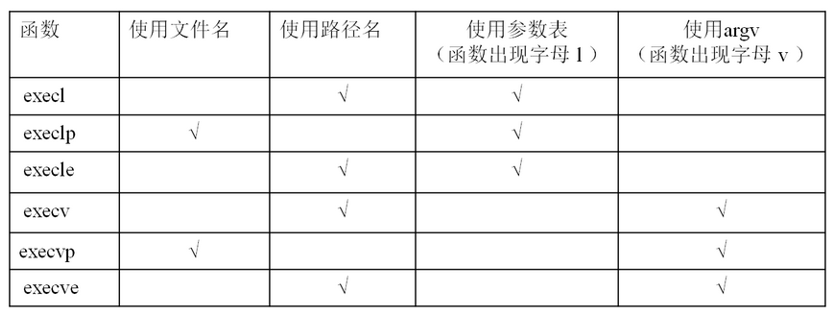

进程相关api
===


### pid_t getpid(void)
头文件:   
   #include <sys/types.h>   
   #include <unistd.h>    
功能：   
    获取本进程号（PID）  
参数：   
    无   
返回值：   
    本进程号   


### pid_t getppid(void)
头文件:   
   #include <sys/types.h>   
   #include <unistd.h>    
功能：    
    获取调用此函数的进程的父进程号（PPID）    
参数：   
    无   
返回值：   
    调用此函数的进程的父进程号（PPID）    


### pid_t getpgid(pid_t pid)
头文件:   
   #include <sys/types.h>   
   #include <unistd.h>    
功能：   
    获取进程组号（PGID）   
参数：   
    pid：进程号    
返回值：    
    参数为 0 时返回当前进程组号，否则返回参数指定的进程的进程组号     

> 参考代码[case_3.c](case_3.c)


### pid_t fork(void)
头文件:   
   #include <sys/types.h>   
   #include <unistd.h>   
功能：    
    用于从一个已存在的进程中创建一个新进程，新进程称为子进程，原进程称为父进程。可以通过返回的`pid_t`的值判断是子进程还是父进程（pid_t == 0 子进程， 》0 父进程）。    
参数：   
    无   
返回值：   
    成功：子进程中返回 0，父进程中返回子进程 ID。pid_t，为整型。    
    失败：返回-1。    
    失败的两个主要原因是：    
        1）当前的进程数已经达到了系统规定的上限，这时 errno 的值被设置为 EAGAIN。    
        2）系统内存不足，这时 errno 的值被设置为 ENOMEM。    
> 参考代码[case_4.c](case_4.c)


### void exit(int status)
头文件:    
   #include <stdlib.h>   
功能：   
    结束调用此函数的进程。   
参数：   
    status：返回给父进程的参数（低 8 位有效），至于这个参数是多少根据需要来填写。   
返回值：   
    无   


### void _exit(int status)
头文件:   
   #include <unistd.h>   
功能：   
    结束调用此函数的进程。   
参数：   
    status：返回给父进程的参数（低 8 位有效），至于这个参数是多少根据需要来填写。   
返回值：
    无   


### pid_t wait(int *status)
头文件:   
   #include <sys/types.h>    
   #include <sys/wait.h>   
功能：   
    等待任意一个子进程结束，如果任意一个子进程结束了，此函数会回收该子进程的资源。    
参数：    
    status : 进程退出时的状态信息。   
返回值：    
    成功：已经结束子进程的进程号
    失败： -1    


### pid_t waitpid(pid_t pid, int *status, int options)
头文件:   
   #include <sys/types.h>    
   #include <sys/wait.h>   
功能：   
    等待子进程终止，如果子进程终止了，此函数会回收子进程的资源。   
参数：   
    pid : 参数 pid 的值有以下几种类型：    
      pid > 0  等待进程 ID 等于 pid 的子进程。   
      pid = 0  等待同一个进程组中的任何子进程，如果子进程已经加入了别的进程组，waitpid 不会等待它。   
      pid = -1 等待任一子进程，此时 waitpid 和 wait 作用一样。   
      pid < -1 等待指定进程组中的任何子进程，这个进程组的 ID 等于 pid 的绝对值。   
​
    status : 进程退出时的状态信息。和 wait() 用法一样。   
​
    options : options 提供了一些额外的选项来控制 waitpid()。    
            0：同 wait()，阻塞父进程，等待子进程退出。   
            WNOHANG：没有任何已经结束的子进程，则立即返回。   
            WUNTRACED：如果子进程暂停了则此函数马上返回，并且不予以理会子进程的结束状态。（由于涉及到一些跟踪调试方面的知识，加之极少用到）   
                 
返回值：    
    waitpid() 的返回值比 wait() 稍微复杂一些，一共有 3 种情况：   
        1) 当正常返回的时候，waitpid() 返回收集到的已经回收子进程的进程号；   
        2) 如果设置了选项 WNOHANG，而调用中 waitpid() 发现没有已退出的子进程可等待，则返回 0；   
        3) 如果调用中出错，则返回-1，这时 errno 会被设置成相应的值以指示错误所在，如：当 pid 所对应的子进程不存在，或此进程存在，但不是调用进程的子进程，waitpid() 就会出错返回，这时 errno 被设置为 ECHILD；    

调用 wait() 函数的进程会挂起（阻塞），直到它的一个子进程退出或收到一个不能被忽视的信号时才被唤醒。    

> 一次wait或waitpid调用只能清理一个子进程，清理多个子进程应使用循环

status 宏
| 值 | 描述 | 使用方式 |
| ---- | --- | ------ |
| WIFEXITED | 为非0 → 进程正常结束 | WEXITSTATUS(status) 如上宏为真，使用此宏 → 获取进程退出状态 (exit的参数)
| WIFSIGNALED | 为非0 → 进程异常终止 | WTERMSIG(status) 如上宏为真，使用此宏 → 取得使进程终止的那个信号的编号。
| WIFSTOPPED | 为非0 → 进程处于暂停状态 | WSTOPSIG(status) 如上宏为真，使用此宏 → 取得使进程暂停的那个信号的编号。
| WIFCONTINUED | 为真 → 进程暂停后已经继续运行 | 


### 调用其他命令
```c
#include <unistd.h>
extern char **environ;
​
int execl(const char *path, const char *arg, .../* (char  *) NULL */);
int execlp(const char *file, const char *arg, ... /* (char  *) NULL */);
int execle(const char *path, const char *arg, .../*, (char *) NULL, char * const envp[] */);
int execv(const char *path, char *const argv[]);
int execvp(const char *file, char *const argv[]);
int execvpe(const char *file, char *const argv[], char *const envp[]);
​
int execve(const char *filename, char *const argv[], char *const envp[]);
```
其中只有 `execve()` 是真正意义上的系统调用，其它都是在此基础上经过包装的库函数。    

进程调用一种 exec 函数时，该进程完全由新程序替换，而新程序则从其 main 函数开始执行。因为调用 exec 并不创建新进程，所以前后的进程 ID并未改变，其他都已变化。    

exec 函数族的 6 个函数看起来似乎很复杂，但实际上无论是作用还是用法都非常相似，只有很微小的差别    


补充说明：
| 参数 | 说明 |
| ----- | ----- |
| l(list) |	参数地址列表，以空指针结尾
| v(vector) |	存有各参数地址的指针数组的地址
| p(path) |	按 PATH 环境变量指定的目录搜索可执行文件
| e(environment) |	存有环境变量字符串地址的指针数组的地址

exec 函数族中的函数执行成功后不会返回，而且，exec 函数族下面的代码执行不到。只有调用失败了，它们才会返回 -1，失败后从原程序的调用点接着往下执行   


### int pipe(int pipefd[2])
头文件:   
   #include <unistd.h>    
功能：   
    创建无名管道。   
​
参数：   
    pipefd : 为 int 型数组的首地址，其存放了管道的文件描述符 pipefd[0]、pipefd[1]。   
    
    当一个管道建立时，它会创建两个文件描述符 fd[0] 和 fd[1]。其中 fd[0] 固定用于读管道，而 fd[1] 固定用于写管道。一般文件 I/O的函数都可以用来操作管道(lseek() 除外)。   
​
返回值：
    成功：0   
    失败：-1   

> 参考代码[case_5.c](case_5.c)


### long fpathconf(int fd, int name)
头文件:   
   #include <unistd.h>    
功能：     
    该函数可以通过name参数查看不同的属性值    
参数：    
    fd：文件描述符    
    name：    
        _PC_PIPE_BUF，查看管道缓冲区大小    
        _PC_NAME_MAX，文件名字字节数的上限   
返回值：   
    成功：根据name返回的值的意义也不同。    
    失败： -1    
eg `long num = fpatchconf(fd[0], _PC_PIPE_BUF);`


### int mkfifo(const char *pathname, mode_t mode)
头文件:   
    #include <sys/types.h>    
    #include <sys/stat.h>   
功能：   
    命名管道的创建。   
参数：   
    pathname : 普通的路径名，也就是创建后 FIFO 的名字。   
    mode : 文件的权限，与打开普通文件的 open() 函数中的 mode 参数相同。(0666)   
返回值：   
    成功：0   状态码   
    失败：如果文件已经存在，则会出错且返回 -1。   