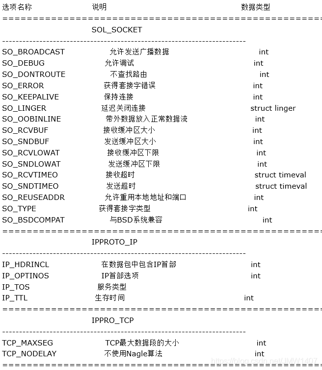

Socket API
===

## 重点API

### uint16_t htons(uint16_t hostlong)
头文件:   
    #include <arpa/inet.h>   
功能：
    将端口号换为字节序       
参数:    
    hostlong: 端口号   
返回值：   
    字节序

>eg `servadd.sin6_port = htons(9200)`


### uint32_t htonl(uint32_t hostlong)
头文件:   
    #include <arpa/inet.h>   
功能：
    将字节序转换为端口号       
参数:    
    hostlong: 网络字节序   
返回值：   
    端口号

>eg `ntohs(client.sin6_port)`
    

### int inet_pton (int domain, const char *addr, void *input)
头文件:   
    #include <arpa/inet.h>   
功能：
    将ip地址转换为字节序        
参数:    
    domain:   
        AF_INET 这是大多数用来产生 socket 的协议，使用 TCP 或 UDP 来传输，用 IPv4 的地址   
        AF_INET6 与上面类似，不过是来用 IPv6 的地址    
        AF_UNIX 本地协议，使用在 Unix 和 Linux 系统上，一般都是当客户端和服务器在同一台及其上的时候使用       
    addr: 地址， struct sockaddr的目标地址    
    input: 输入的地址，例如"127.0.0.1"    
返回值：     
    成功：返回指向新创建的 socket 的文件描述符    
    失败：返回-1，设置 errno  

>eg `char ip[32] = ":::"; const char* addr = (const char*)&servadd.sin6_addr.s6_addr; inet_pton(AF_INET6, addr, ip);`    
> eg `inet_pton(AF_INET, "127.0.0.1", &server.sin_addr.s_addr);`


### const char * inet_ntop(int domain, const char *addr, char *buf, int bufsize)
头文件:   
    #include <arpa/inet.h>   
功能：
    将字节序转换为ip地址        
参数:    
    domain:   
        AF_INET 这是大多数用来产生 socket 的协议，使用 TCP 或 UDP 来传输，用 IPv4 的地址   
        AF_INET6 与上面类似，不过是来用 IPv6 的地址    
        AF_UNIX 本地协议，使用在 Unix 和 Linux 系统上，一般都是当客户端和服务器在同一台及其上的时候使用       
    addr: 地址， struct sockaddr的目标地址    
    buf: 读取的地址，例如"char client_ip[32] = { 0 }"     
    bufsize: 读取的地址的大小     
返回值：     
    ip的字符串

> eg: `char client_ip[32] = { 0 }; inet_ntop(AF_INET6, &client.sin6_addr.s6_addr, client_ip, sizeof(client_ip))`


详见代码[case_1.c](case_1.c); [点分制ip转换子节序](case_2.c);


### int socket(int domain, int type, int protocol)
头文件:   
    #include <sys/types.h> /* See NOTES */   
    #include <sys/socket.h>   
功能：
    创建一个Socket客户端   
参数:  
    domain:   
        AF_INET 这是大多数用来产生 socket 的协议，使用 TCP 或 UDP 来传输，用 IPv4 的地址   
        AF_INET6 与上面类似，不过是来用 IPv6 的地址    
        AF_UNIX 本地协议，使用在 Unix 和 Linux 系统上，一般都是当客户端和服务器在同一台及其上的时候使用    
    type:   
        SOCK_STREAM 这个协议是按照顺序的、可靠的、数据完整的基于字节流的连接。这是一个使用最多的 socket 类型，这个 socket是使用 TCP 来进行传输。   
        SOCK_DGRAM 这个协议是无连接的、固定长度的传输调用。该协议是不可靠的，使用 UDP 来进行它的连接。    
        SOCK_SEQPACKET 该协议是双线路的、可靠的连接，发送固定长度的数据包进行传输。必须把这个包完整的接受才能进行读取。     
        SOCK_RAW socket 类型提供单一的网络访问，这个 socket 类型使用 ICMP 公共协议。（ping、traceroute 使用该协议）    
        SOCK_RDM 这个类型是很少使用的，在大部分的操作系统上没有实现，它是提供给数据链路层使用，不保证数据包的顺序       
    protocol:    
        传 0 表示使用默认协议。     
返回值：     
    成功：返回指向新创建的 socket 的文件描述符    
    失败：返回-1，设置 errno    


### int bind(int sockfd, const struct sockaddr *addr, socklen_t addrlen)
头文件:   
    #include <sys/types.h> /* See NOTES */   
    #include <sys/socket.h>   
功能：
    绑定端口   
参数:  
    sockfd: socket 文件描述符    
    addr: 构造出 IP 地址加端口号   
    addrlen: sizeof(addr)长度    
返回值：   
    成功返回 0    
    失败返回-1, 设置 errno    

bind()的作用是将参数 sockfd 和 addr 绑定在一起，使 sockfd 这个用于网络通讯的文件描述符监听 addr 所描述的地址和端口号。struct sockaddr *是一个通用指针类型，addr 参数实际上可以接受多种协议的 sockaddr结构体，而它们的长度各不相同，所以需要第三个参数 addrlen 指定结构体的长度。 


### int listen(int sockfd, int backlog)
头文件:    
    #include <sys/types.h> /* See NOTES */   
    #include <sys/socket.h>   
功能：
    监听端口并启动服务   
参数:    
    sockfd: socket 文件描述符   
    backlog:  指定队列的最大长度，用于记录正在连接但尚未完成的客户端请求       
返回值：   
    成功返回 0    
    失败返回-1, 设置 errno        


### ssize_t recv(int sockfd, void *buf, size_t len, int flags)
头文件:    
    #include <sys/types.h> /* See NOTES */   
    #include <sys/socket.h>   
功能：
    系统调用，用于从套接字接收数据。不论是客户还是服务器应用程序都用recv函数从TCP连接的另一端接收数据   
参数:    
    sockfd：一个已打开的套接字的描述符    
    buf：一个指针，指向用于存放接收到的数据的缓冲区   
    len：缓冲区的大小（以字节为单位）   
    flags：控制接收行为的标志。通常可以设置为0   
        MSG_CMSG_CLOEXEC 
        MSG_DONTWAIT	仅本操作非阻塞    
        MSG_OOB	发送或接收带外数据   
        MSG_PEEK	窥看外来消息    
        MSG_WAITALL	等待所有数据    
返回值：   
    在成功的情况下，recvfrom() 返回接收到的字节数。   
    如果没有数据可读或套接字已经关闭，那么返回值为0。   
    出错时，返回 -1，并设置全局变量 errno 以指示错误类型。   


### ssize_t recvfrom(int sockfd, void *buf, size_t len, int flags, struct sockaddr *src_addr, socklen_t *addrlen)
头文件:    
    #include <sys/types.h> /* See NOTES */   
    #include <sys/socket.h>   
功能：
    系统调用，用于从套接字接收数据。该函数通常与无连接的数据报服务（如 UDP）一起使用       
参数:    
    sockfd：一个已打开的套接字的描述符    
    buf：一个指针，指向用于存放接收到的数据的缓冲区   
    len：缓冲区的大小（以字节为单位）   
    flags：控制接收行为的标志。通常可以设置为0，但以下是一些可用的标志：   
        MSG_WAITALL：尝试接收全部请求的数据。函数可能会阻塞，直到收到所有数据。   
        MSG_PEEK：查看即将接收的数据，但不从套接字缓冲区中删除它。   
        其他一些标志还可以影响函数的行为，但在大多数常规应用中很少使用。   
    src_addr：一个指针，指向一个 sockaddr 结构，用于保存发送数据的源地址    
    addrlen：一个值-结果参数。开始时，它应该设置为 src_addr 缓冲区的大小。当 `recvfrom()` 返回时，该值会被修改为实际地址的长度（以字节为单位）。    
返回值：   
    在成功的情况下，recvfrom() 返回接收到的字节数。   
    如果没有数据可读或套接字已经关闭，那么返回值为0。   
    出错时，返回 -1，并设置全局变量 errno 以指示错误类型。   

```c
struct sockaddr_in sender;
socklen_t sender_len = sizeof(sender);
char buffer[1024];

int bytes_received = recvfrom(sockfd, buffer, sizeof(buffer), 0,
                              (struct sockaddr*)&sender, &sender_len);
if (bytes_received < 0) {
    perror("recvfrom failed");
    // handle error
}
```


### ssize_t send(int sockfd, const void *buf, size_t len, int flags)
头文件:    
    #include <sys/types.h> /* See NOTES */   
    #include <sys/socket.h>   
功能：
    系统调用，用于发送数据到一个指定文件描述符    
参数:    
    sockfd：一个已打开的套接字的描述符   
    buf：一个指针，指向要发送的数据的缓冲区     
    len：要发送的数据的大小（以字节为单位）     
    flags：控制发送行为的标志。通常可以设置为0。一些可用的标志包括：    
        MSG_DONTROUTE	绕过路由表查找   
        MSG_DONTWAIT	仅本操作非阻塞   
        MSG_OOB	发送或接收带外数据   
返回值：    
    成功时，sendto() 返回实际发送的字节数。     
    出错时，返回 -1 并设置全局变量 errno 以指示错误类型。    


### ssize_t sendto(int sockfd, const void *buf, size_t len, int flags, const struct sockaddr *dest_addr, socklen_t addrlen)
头文件:    
    #include <sys/types.h> /* See NOTES */   
    #include <sys/socket.h>   
功能：
    系统调用，用于发送数据到一个指定的地址。它经常与无连接的数据报协议，如UDP，一起使用   
参数:    
    sockfd：一个已打开的套接字的描述符   
    buf：一个指针，指向要发送的数据的缓冲区     
    len：要发送的数据的大小（以字节为单位）     
    flags：控制发送行为的标志。通常可以设置为0。一些可用的标志包括：    
        MSG_CONFIRM：在数据报协议下告诉网络层该数据已经被确认   
        MSG_DONTROUTE：不查找路由，数据报将只发送到本地网络      
        其他标志可以影响函数的行为，但在大多数常规应用中很少使用     
    dest_addr：指向 sockaddr 结构的指针，该结构包含目标地址和端口信息     
    addrlen：dest_addr 缓冲区的大小（以字节为单位）     
返回值：    
    成功时，sendto() 返回实际发送的字节数。     
    出错时，返回 -1 并设置全局变量 errno 以指示错误类型。     

```c
struct sockaddr_in receiver;
receiver.sin_family = AF_INET;
receiver.sin_port = htons(12345);  // Some port number
inet_pton(AF_INET, "192.168.1.1", &receiver.sin_addr);  // Some IP address

char message[] = "Hello, World!";
ssize_t bytes_sent = sendto(sockfd, message, sizeof(message), 0,
                            (struct sockaddr*)&receiver, sizeof(receiver));
if (bytes_sent < 0) {
    perror("sendto failed");
    // handle error
}
```


### int accept(int sockfd, struct sockaddr *addr, socklen_t *addrlen)
头文件:    
    #include <sys/types.h> /* See NOTES */   
    #include <sys/socket.h>   
功能：接收客户端请求    
参数:    
    sockdf: socket 文件描述符    
    addr: 传出参数，返回链接客户端地址信息，含 IP 地址和端口号    
    addrlen: 传入传出参数（值-结果）,传入 sizeof(addr)大小，函数返回时返回真正接收到地址结构体的大小   
返回值：    
    成功返回一个新的 socket 文件描述符，用于和客户端通信    
    失败返回-1，设置 errno    


### int connect(int sockfd, const struct sockaddr *addr, socklen_t addrlen)
头文件:    
    #include <sys/types.h> /* See NOTES */   
    #include <sys/socket.h>   
功能：
    连接服务端    
参数:    
    sockdf: socket 文件描述符     
    addr: 传入参数，指定服务器端地址信息，含 IP 地址和端口号    
    addrlen: 传入参数,传入 sizeof(addr)大小    
返回值：    
    成功返回 0   
    失败返回-1，设置 errno   


### int setsockopt(int sockFd, int level, int optname, const void *optval, socklen_t optlen)
头文件:    
    #include <sys/types.h>   
    #include <sys/socket.h>   
功能：
    端口复用允许在一个应用程序可以把 n 个套接字绑在一个端口上而不出错   
参数:    
    sockfd：将要被设置或者获取选项的套接字。   
    level：选项定义的层次；支持SOL_SOCKET、IPPROTO_TCP、IPPROTO_IP和IPPROTO_IPV6。一般设成SOL_SOCKET以存取socket层   
        SOL_SOCKET:通用套接字选项.   
        IPPROTO_IP:IP选项.IPv4套接口   
        IPPROTO_TCP:TCP选项.   
        IPPROTO_IPV6: IPv6套接口   
    optname： 参考下图   
    optval： 配置值
    optlen： 配置长度sizeof

optname选项



### int select(int nfds, fd_set *readfds, fd_set *writefds, fd_set *exceptfds, struct timeval *timeout)
头文件:    
    #include <sys/select.h> /* According to earlier standards */   
    #include <sys/time.h>    
    #include <sys/types.h>    
    #include <unistd.h>    
功能: 
    多路复用I/O - SELECT 模型    
参数:    
    nfds:监控的文件描述符集里最大文件描述符加 1，因为此参数会告诉内核检测前多少个文件描述符的状态   
    readfds：监控有读数据到达文件描述符集合，传入传出参数   
    writefds：监控写数据到达文件描述符集合，传入传出参数   
    exceptfds： 监控异常发生达文件描述符集合,如带外数据到达异常，传入传出参数   
    timeout： 定时阻塞监控时间，3 种情况   
        1.NULL，永远等下去   
        2.设置 timeval，等待固定时间   
        3.设置 timeval 里时间均为 0，检查描述字后立即返回，轮询   
返回值：    
    成功返回 就绪描述字的个数  
    超时 0   
    失败返回-1，设置 errno   

timeval结构体 和 select FD 操作函数的描述
```c
struct timeval
{
    long tv_sec; /* seconds, 秒 */
    long tv_usec; /* microseconds， 毫秒 */
}

void FD_CLR(int fd, fd_set *set);  // 删除，把文件描述符集合里 fd 位清 0
int FD_ISSET(int fd, fd_set *set); // 是否变动，测试文件描述符集合里 fd 是否置 1
void FD_SET(int fd, fd_set *set); // 添加， 把文件描述符集合里 fd 位置 1
void FD_ZERO(fd_set *set); // 初始化，把文件描述符集合里所有位清 0
```


### int pselect(int nfds, fd_set *readfds, fd_set *writefds, fd_set *exceptfds, const struct timespec *timeout, const sigset_t *sigmask)
头文件:    
    #include <sys/select.h> /* According to earlier standards */   
    #include <sys/time.h>    
    #include <sys/types.h>    
    #include <unistd.h>    
功能: 
    多路复用I/O - PSELECT 模型    
参数:    
    nfds:监控的文件描述符集里最大文件描述符加 1，因为此参数会告诉内核检测前多少个文件描述符的状态   
    readfds：监控有读数据到达文件描述符集合，传入传出参数   
    writefds：监控写数据到达文件描述符集合，传入传出参数   
    exceptfds： 监控异常发生达文件描述符集合,如带外数据到达异常，传入传出参数   
    timeout： 定时阻塞监控时间，3 种情况   
        1.NULL，永远等下去   
        2.设置 timeval，等待固定时间   
        3.设置 timeval 里时间均为 0，检查描述字后立即返回，轮询   
    sigmask: 当前进程的阻塞信号集，其设置内容如下     
        1.信号集,指定屏蔽        
        2.NULL,不屏蔽    
返回值：  
    成功返回 就绪描述字的个数  
    超时 0   
    失败返回-1，设置 errno   

struct timespec结构
```c
struct timespec {
    time_t tv_sec;     //seconds
    long    tv_nsec;    //nanoseconds
};
```

其余操作同`SELECT`


### int poll(struct pollfd *fds, nfds_t nfds, int timeout)
头文件:    
    #include <poll.h> /* According to earlier standards */      
功能: 
    多路复用I/O - POLL 模型    
参数:    
    fds: pollfd结构体   
    nfds: 监控的文件描述符集里最大文件描述符   
    timeout: 毫秒级等待    
        -1：阻塞等，#define INFTIM -1   
        0：立即返回，不阻塞进程    
        >0：等待指定毫秒数，如当前系统时间精度不够毫秒，向上取值    
返回值：  
    成功返回 返回结构体中 revents 域不为 0 的文件描述符个数  
    超时 0   
    失败返回-1，设置 errno   
        

struct pollfd 结构体
```c
struct pollfd {
    int fd;         /* 文件描述符 */
    short events;   /* 监控的事件 */
    short revents;  /* 监控事件中满足条件返回的事件，实际发生的事件 */
}
```

读事件   
**POLLIN** 普通或带外优先数据可读,即 POLLRDNORM | POLLRDBAND    
POLLRDNORM 数据可读    
POLLRDBAND 优先级带数据可读    
POLLPRI 高优先级可读数据   

写事件  
**POLLOUT**普通或带外数据可写    
POLLWRNORM数据可写    
POLLWRBAND优先级带数据可写    

异常事件    
**POLLERR**发生错误    
POLLHUP发生挂起    
POLLNVAL描述字不是一个打开的文件    


### int ppoll(struct pollfd *fds, nfds_t nfds, const struct timespec *timeout_ts, const sigset_t *sigmask)
头文件:    
    #define _GNU_SOURCE /* See feature_test_macros(7) */
    #include <poll.h> /* According to earlier standards */      
功能: 
    多路复用I/O - PPOLL 模型    
参数:    
    fds: pollfd结构体   
    nfds: 监控的文件描述符集里最大文件描述符   
    timeout： 定时阻塞监控时间，3 种情况   
        1.NULL，永远等下去   
        2.设置 timeval，等待固定时间   
        3.设置 timeval 里时间均为 0，检查描述字后立即返回，轮询   
    sigmask: 当前进程的阻塞信号集，其设置内容如下     
        1.信号集,指定屏蔽        
        2.NULL,不屏蔽     
返回值：  
    成功返回 返回结构体中 revents 域不为 0 的文件描述符个数  
    超时 0   
    失败返回-1，设置 errno   

struct timespec结构
```c
struct timespec {
    time_t tv_sec;     //seconds
    long    tv_nsec;    //nanoseconds
};
```

其他同 `POLL`


### int epoll_create(int size)
头文件:    
    #include <sys/epoll.h> /* According to earlier standards */   
功能: 
    创建一个 epoll 句柄，参数 size 用来告诉内核监听的文件描述符的个数，跟内存大小有关     
参数:    
    size：监听数目（内核参考值）
返回值：   
    成功：非负文件描述符    
    失败：-1，设置相应的 errno   


### int epoll_ctl(int epfd, int op, int fd, struct epoll_event *event)
头文件:    
    #include <sys/epoll.h> /* According to earlier standards */   
功能: 
    控制某个 epoll 监控的文件描述符上的事件：注册、修改、删除     
参数:    
    epfd：为 epoll_creat 的句柄   
    op：表示动作，用 3 个宏来表示    
        EPOLL_CTL_ADD (注册新的 fd 到 epfd)，    
        EPOLL_CTL_MOD (修改已经注册的 fd 的监听事件)，    
        EPOLL_CTL_DEL (从 epfd 删除一个 fd)；    
    fd: 文件描述符
    event： 告诉内核需要监听的事件    
返回值：
    成功：0    
    失败：-1，设置相应的 errno    

struct epoll_event 结构
```c
struct epoll_event {
    __uint32_t events; /* Epoll events */
    epoll_data_t data; /* User data variable */
};
typedef union epoll_data {
    void *ptr;
    int fd;
    uint32_t u32;
    uint64_t u64;
} epoll_data_t;
```

events 事件宏列表

读事件   
EPOLLIN ：表示对应的文件描述符可以读（包括对端 SOCKET 正常关闭）   

写事件   
EPOLLOUT：表示对应的文件描述符可以写   
EPOLLPRI：表示对应的文件描述符有紧急的数据可读（这里应该表示有带外数据到来）   

异常事件    
EPOLLERR：表示对应的文件描述符发生错误   
EPOLLHUP：表示对应的文件描述符被挂断；   
EPOLLET：将 EPOLL 设为边缘触发(Edge Triggered)模式，这是相对于水平触发(Level Triggered)而言的   
EPOLLONESHOT：只监听一次事件，当监听完这次事件之后，如果还需要继续监听这个 socket 的话，需要再次把这个socket 加入到 EPOLL 队列里     


### epoll_wait(int epfd, struct epoll_event *events, int maxevents, int timeout)
头文件:    
    #include <sys/epoll.h> /* According to earlier standards */   
功能: 
    等待所监控文件描述符上有事件的产生，类似于 select()调用     
参数:    
    events：用来存内核得到事件的集合，可简单看作数组。    
    maxevents： 告之内核这个 events 有多大，这个 maxevents 的值不能大于创建 epoll_create()时的 size     
    timeout：超时时间    
        -1： 阻塞     
        0： 立即返回，非阻塞     
        >0： 指定毫秒    
返回值：      
    成功: 返回有多少文件描述符就绪    
    时间到时返回 0   
    出错返回-1    

参考代码[case_7.c](case_7.c)


### gethostbyname
功能: 
    根据给定的主机名，获取主机信息     


### gethostbyaddr
功能: 
    此函数只能获取域名解析服务器的 url 和/etc/hosts 里登记的 IP 对应的域名     


### getservbyname
功能: 
         


### getservbyport
功能: 
         


### getaddrinfo
功能: 
         


### getnameinfo
功能: 
         


### freeaddrinfo
功能: 
    可同时处理 IPv4 和 IPv6，线程安全的     


### getsockname
功能: 
    根据 accpet 返回的 sockfd，得到临时端口号     


### getpeername
功能: 
    根据 accpet 返回的 sockfd，得到远端链接的端口号，在 exec 后可以获取客户端信息     