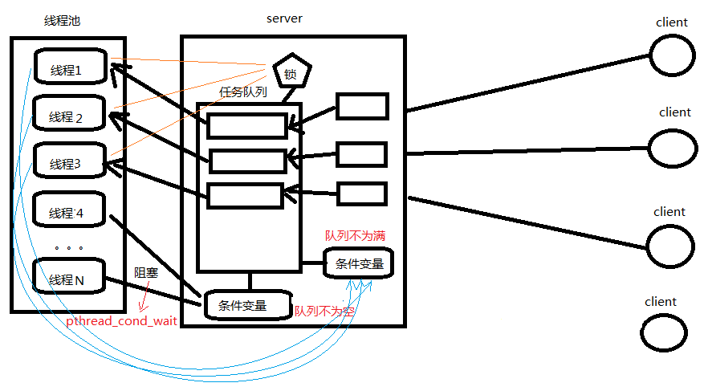

Linux 网络编程
===

Socket本身有“插座”的意思，在Linux环境下，用于表示进程间网络通信的特殊文件类型。本质为内核借助缓冲区形成的伪文件

## 字节序大小端转换
为使网络程序具有可移植性，使同样的C代码在大端和小端计算机上编译后都能正常运行，可以调用以下库函数做网络字节序和主机字节序的转换。

## Socket Server && Client

`socket()`打开一个网络通讯端口，如果成功的话，就像 open()一样返回一个文件描述符，应用程序可以像读写文件一样用 read/write 在网络上收发数据，如果 socket()调用出错则返回-1。   
* 对于 IPv4，domain 参数指定为 AF_INET。   
* 对于 TCP 协议，type 参数指定为 SOCK_STREAM，表示面向流的传输协议。如果是 UDP 协议，则 type 参数指定为 SOCK_DGRAM，表示面向数据报的传输协议。
* protocol 参数的介绍从略，指定为 0 即可

重点api 可以参考 [socket_api.md](./socket_api.md)

### TCP
设置 socket 类型为 `SOCK_STREAM`， 需要绑定并进行监听，并在监听的时候调用`accetp`函数获取客户端，最后通过`write`方法实现通信。

代码参考:
[IPV6 TCP Server](case_3.c) / [IPV6 TCP Client](case_4.c)       

测试工具`telnet ip port`
> eg: IPV6 `telnet ::1 9200` 或 IPV4 `telnet 0.0.0.0 9291`

### UDP

UDP 通信的形式更像是发短信。不需要在数据传输之前建立、维护连接。只专心获取数据就好。省去了三次握手的过程，通信速度可以大大提高，但与之伴随的通信的稳定性和正确率便得不到保证。   

设置 socket 类型为 `SOCK_DGRAM`，需要绑定即可，不用监听就能启动服务！读取参考如下代码
```c
struct sockaddr_in cli;
socklen_t len=sizeof(cli);
char chunk[1500] = {0};
while(1)
{
    memset(chunk, 0, 1500);
    recvfrom(sockfd, chunk, sizeof(chunk), 0, (struct sockaddr*)&cli, &len);
    printf("recv num =%s \n", chunk);
    sendto(sockfd, chunk, sizeof(chunk), 0, (struct sockaddr*)&cli, len);
}

close(sockfd);
```
代码参考:
[IPV6 UDP Server](case_8.c) / [IPV6 UDP Client](case_9.c)       

测试工具`nc <opt>... ip port`
```
opt 如下:

-u udp客户端
-l udp服务端，需要监听端口
```
> eg: IPV6 `nc -u ::1 9300`或 IPV4 `nc -u 127.0.0.1 9301`

与 TCP 类似的，UDP 也有可能出现缓冲区被填满后，再接收数据时丢包的现象。通常采用如下两种方法解决：

1.服务器应用层设计流量控制，控制发送数据速度
2.借助 setsockopt 函数改变接收缓冲区大小。如：
```c
#include <sys/socket.h>
int setsockopt(int sockfd, int level, int optname, const void *optval, socklen_t optlen);

int n = 220x1024;
setsockopt(sockfd, SOL_SOCKET, SO_RCVBUF, &n, sizeof(n));
```


### socket ipc / domain / uds
IPC 机制，就是 UNIX Domain Socket (uds), 用于同一台主机的进程间通讯（通过 loopback 地址 127.0.0.1）
，但是 UNIX Domain Socket 用于IPC 更有效率：不需要经过网络协议栈，不需要打包拆包、计算校验和、维护序号和应答等，只是将应用层数据从一个进程拷贝到另一个进程。     

UNIX Domain Socket 也提供面向流和面向数据包两种 API 接口，类似于 TCP 和 UDP，但是面向消息的 UNIX Domain Socket 也是可靠的，消息既不会丢失也不会顺序错乱。    

UNIX Domain Socket 与网络 socket 编程最明显的不同在于地址格式不同，用结构体 sockaddr_un 表示，网络编程的 socket 地址是 IP 地址加端口号，而 UNIX Domain Socket 的地址是一个 socket 类型的文件在文件系统中路径，这个 socket 文件由 bind()调用创建，如果调用 bind()时该文件已存在，则 bind()错误返回。

代码参考:
[IPV6 TCP Server](case_10.c) / [IPV6 TCP Client](case_11.c)       

测试工具`curl -v  --unix-socket /tmp/nginx-status-server.sock http://nginx_status /`
> eg: IPV6 `telnet ::1 9200` 或 IPV4 `telnet 0.0.0.0 9291`


## 高并发服务器

使用多进程并发服务器时要考虑以下几点：

1. 父进程最大文件描述个数(父进程中需要 close 关闭 accept 返回的新文件描述符)
2. 系统内创建进程个数(与内存大小相关)
3. 进程创建过多是否降低整体服务性能(进程调度)
4. 调整进程内最大文件描述符上限
5. 线程如有共享数据，考虑线程同步
6. 服务于客户端线程退出时，退出处理。（退出值，分离态）
7. 系统负载，随着链接客户端增加，导致其它线程不能及时得到 CPU

## 多路I/O转接服务器
多路 IO 转接服务器也叫做多任务 IO 服务器。该类服务器实现的主旨思想是，不再由应用程序自己监视客户端连接，取而代之由内核替应用程序监视文件。

### SELECT
select 能监听的文件描述符个数受限于 FD_SETSIZE，一般为 1024，单纯改变进程打开的文件描述符个数并不能改变 select 监听文件个数。
1024 以下客户端时使用 select 是很合适的，但如果链接客户端过多，select 采用的是轮询模型，会大大降低服务器响应效率，不应在 select 上投入更多精力。

使用 SELECT 构建服务的大致流程：
1. 建立TCP ipv6链接
2. 绑定前设置socket支持复用`setsockopt(ss, SOL_SOCKET, SO_REUSEADDR, &opt, sizeof(opt));`
3. 绑定并监听
4. 设置最大文件数和SELECT监听队列;
5. 循环，在SELECT中获取变动的文件，并分别判断类型并执行相关操作。

> 参考代码[case_5.c](case_5.c) / [相关API - SELECT](./socket_api.md)   

### PSELECT
和select基本差不多，但有下面三个区别：
* select函数使用的timeout参数是struct timeval(以秒和微秒表示)类型的，而pselect函数使用struct timespec(以秒或纳秒表示)
* select可以更新timeout参数以指示剩余的时间。pselect的timeout参数声明为const确保其不会更改此参数。
* pselect可以选择使用的信号屏蔽字。若sigmask为空，那么在与信号有关的方面，pselect的运行状况和select相同。否则，sigmask指向一信号屏蔽字，在调用pselect时，以原子操作的方式安装该信号屏蔽字。在返回时恢复以前的信号屏蔽字。

> [相关API - SELECT](./socket_api.md)   

### POLL
如果不再监控某个文件描述符时，可以把 pollfd 中，fd 设置为-1，poll 不再监控此 pollfd，下次返回时，把 revents
设置为 0。   
相较于 select 而言，poll 的优势：   
1. 传入、传出事件分离。无需每次调用时，重新设定监听事件。  
2. 没有最大文件描述符数量的限制, 能监控的最大上限数可使用配置文件调整, 但是数量过大后性能也是会下降。   

> 参考代码[case_6.c](case_6.c) / [相关API - SELECT](./socket_api.md)   

### PPOLL
GNU 定义了 ppoll（非 POSIX 标准），可以支持设置信号屏蔽字。    

使用上同POLL，可选择使用信号屏蔽字。若sigmask为空，那么在与信号有关的方面，ppoll的运行状况和poll相同。否则，sigmask指向一信号屏蔽字，在调用ppoll时，以原子操作的方式安装该信号屏蔽字。在返回时恢复以前的信号屏蔽字。    

> [相关API - SELECT](./socket_api.md)   

### EPOLL
epoll 是 Linux 下多路复用 IO 接口 select/poll 的增强版本，它能显著提高程序在大量并发连接中只有少量活跃的情况下的系统 CPU 利用率，因为它会复用文件描述符集合来传递结果而不用迫使开发者每次等待事件之前都必须重新准备要被侦听的文件描述符集合，另一点原因就是获取事件的时候，它无须遍历整个被侦听的描述符集，只要遍历那些被内核 IO 事件异步唤醒而加入 Ready 队列的描述符集合就行了。   

目前 epoll 是 linux 大规模并发网络程序中的热门首选模型。epoll 除了提供 select/poll 那种 IO 事件的水平触发（Level Triggered）外，还提供了边沿触发（Edge Triggered），这就使得用户空间程序有可能缓存 IO 状态，减少 epoll_wait/epoll_pwait 的调用，提高应用程序效率。    


可以使用 cat 命令查看一个进程可以打开的 socket 描述符上限 `cat /proc/sys/fs/file-max`

修改方式
```shell
sudo vim /etc/security/limits.conf

# 在文件尾部写入以下配置, soft 软限制，hard 硬限制。如下图所示。
* soft nofile 65536
* hard nofile 100000
```

> 参考代码[case_7.c](case_7.c) / [相关API - SELECT](./socket_api.md)   


EPOLL 事件有两种模型：
* Edge Triggered (ET) 边缘触发只有数据到来才触发，不管缓存区中是否还有数据。
* Level Triggered (LT) 水平触发只要有数据都会触发。


#### ET 模式
ET 模式即 Edge Triggered 工作模式。

如果我们在第 1 步将 rfd 添加到 epoll 描述符的时候使用了 EPOLLET 标志，那么在第 5 步调用 epoll_wait 之后将有可能会挂起，因为剩余的数据还存在于文件的输入缓冲区内，而且数据发出端还在等待一个针对已经发出数据的反馈信息。只有在监视的文件句柄上发生了某个事件的时候 ET 工作模式才会汇报事件。因此在第 5 步的时候，调用者可能会放弃等待仍在存在于文件输入缓冲区内的剩余数据。epoll 工作在 ET 模式的时候，必须使用非阻塞套接口，以避免由于一个文件句柄的阻塞读/阻塞写操作把处理多个文件描述符的任务饿死。最好以下面的方式调用 ET模式的 epoll 接口，在后面会介绍避免可能的缺陷。    

  1) 基于非阻塞文件句柄
  2) 只有当 read 或者 write 返回 EAGAIN(非阻塞读，暂时无数据)时才需要挂起、等待。但这并不是说每次 read时都需要循环读，直到读到产生一个 EAGAIN 才认为此次事件处理完成，当 read 返回的读到的数据长度小于请求的数据长度时，就可以确定此时缓冲中已没有数据了，也就可以认为此事读事件已处理完成。
   
#### LT 模式
LT 模式即 Level Triggered 工作模式。与 ET 模式不同的是，以 LT 方式调用 epoll 接口的时候，它就相当于一个速度比较快的 poll，无论后面的数据是否被使用。   

#### 对比
* LT(level triggered)：LT 是缺省的工作方式，并且同时支持 block 和 no-block socket。在这种做法中，内核告诉你一个文件描述符是否就绪了，然后你可以对这个就绪的 fd 进行 IO 操作。如果你不作任何操作，内核还是会继续通知你的，所以，这种模式编程出错误可能性要小一点。传统的 select/poll 都是这种模型的代表。

* ET(edge-triggered)：ET 是高速工作方式，只支持 no-block socket。在这种模式下，当描述符从未就绪变为就绪时，内核通过 epoll 告诉你。然后它会假设你知道文件描述符已经就绪，并且不会再为那个文件描述符发送更多的就绪通知。

> 注意，如果一直不对这个 fd 作 IO 操作(从而导致它再次变成未就绪)，内核不会发送更多的通知(onlyonce).


### 线程池并发服务器
线程池是一个抽象概念，可以简单的认为若干线程在一起运行，线程不退出，等待有任务处理。
1. 以网络编程服务器端为例,作为服务器端支持高并发,可以有多个客户端连接,发出请求,对于多个请求我们每次都去建立线程,这样线程会创建很多,而且线程执行完销毁也会有很大的系统开销,使用上效率很低。
2. 之前在线程篇章中，我们也知道创建线程并非多多益善，所以我们的思路是提前创建好若干个线程，不退出，等待任务的产生，去接收任务处理后等待下一个任务。

实现过程：
1. 假设线程池创建了，线程们如何去协调接收任务并且处理？
2. 线程池上的线程如何能够执行不同的请求任务？



上述问题 1 就很像我们之前学过的生产者和消费者模型，客户端对应生产者，服务器端这边的线程池对应消费者，需要借助互斥锁和条件变量来搞定。  

问题 2 解决思路就是利用回调机制，我们同样可以借助结构体的方式，对任务进行封装，比如任务的数据和任
务处理回调都封装在结构体上，这样线程池的工作线程拿到任务的同时，也知道该如何执行了。   